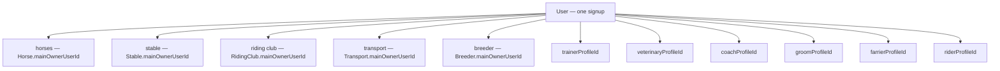
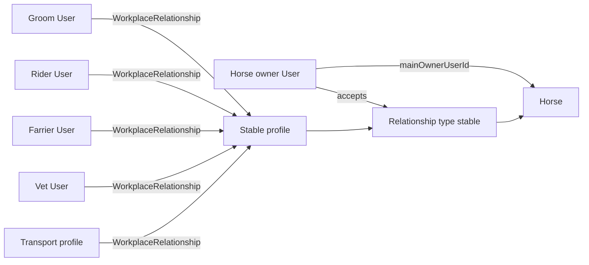
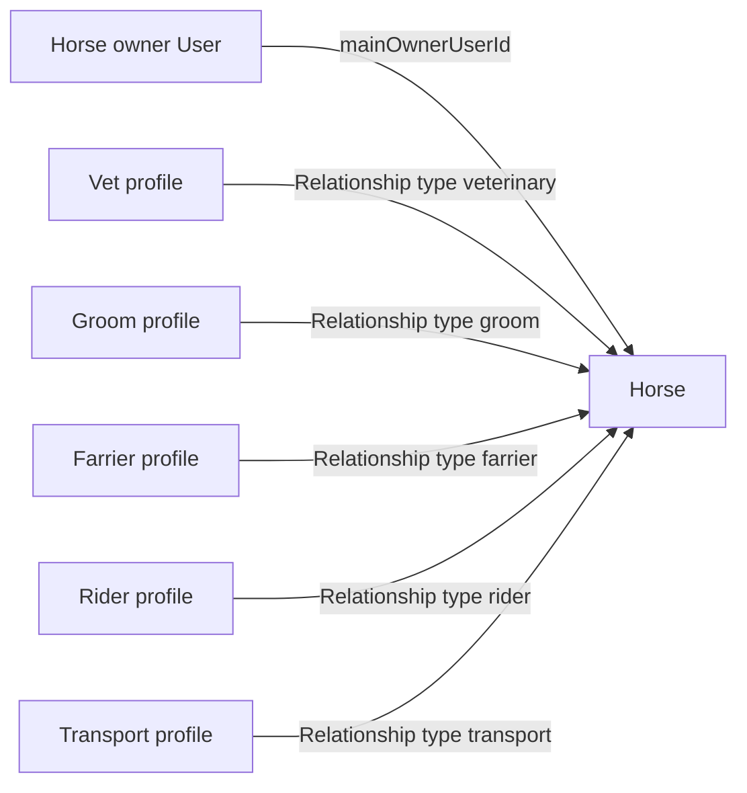

# Stable collaboration (User ↔ role profile)

Canonical product model for how one **User** collaborates at a **role profile** owned by another User — e.g. a groom helping at someone else's **stable profile**.

Related:
- [`userModule.md`](userModule.md) — one login, role profiles on User, horse relationships
- [`productFlows.md`](productFlows.md) — Flow 7 (collaborator at a stable profile)
- [`stableModule.md`](stableModule.md) — team management features

---

## Architecture overview

The platform has **one signup type** (`User`). That User may add **subsections** — entity-owned (`Horse`, `Stable`, `RidingClub`, `Transport`, `Breeder` via `mainOwnerUserId` / `coOwners[]`) and user-linked role profiles (`trainerProfileId`, `groomProfileId`, etc.). The product revolves around **horses**. Services usually flow through a **stable**, but a **horse owner** may also link **providers directly to a horse** when they allow it.

**Nobody owns nobody (people):** Users do not own other Users. `mainOwnerUserId` on entity-owned profiles means who **operates that record**, not employer/employee.

### Diagram 1 — One signup, many subsections

Entity-owned types are queried via `mainOwnerUserId` / `coOwners[]` on the entity (not `*ProfileId` on `User`). User-linked types use `*ProfileId` on `User` plus `userId` on the role document.



### Diagram 2 — Default path: services via stable

Providers collaborate at a **stable profile** (`WorkplaceRelationship`). The **horse owner** accepts a **horse ↔ stable** `Relationship`; the stable serves hosted horses.



### Diagram 3 — Direct path: horse owner links provider on horse

No stable in the middle — the **horse owner** accepts **horse ↔ provider** `Relationship` links (vet, groom, farrier, etc.).



---

## Why link documents instead of bare refs?

Models are independent; they **relate** to allow interaction. The question is where that relationship lives.

Bare arrays (e.g. `Horse.stableIds[]`, `Stable.hostedHorseIds[]`) only work for always-active links. Equus needs **invite → accept → decline**, **invites before signup**, **permanent history when a link ends**, **query from either side**, and **attach invoices/ratings/docs to the link**. That requires a **link document**:

| Link type | Collection | Scope |
|-----------|------------|-------|
| **Horse relationship** | `Relationship` | Horse ↔ provider role profile (horse owner consent) |
| **Stable collaboration** | `WorkplaceRelationship` | User ↔ host role profile (stable, breeder, riding club, transport) |

See [`equus/models/Relationship.ts`](../equus/models/Relationship.ts) and `WorkplaceRelationship` in the codebase.

---

## Two link types — terminology

| Term | Collection | Scope | Example |
|------|------------|-------|---------|
| **Horse relationship** | `Relationship` | Horse ↔ provider role profile | Horse owner accepts Sunrise Stable for Comet; horse owner accepts Dr. Lee (vet) for Comet at home |
| **Stable collaboration** | `WorkplaceRelationship` | User ↔ host role profile | Carla (groom subsection) collaborates at Sunrise Stable |

**Banned in docs/UI:** "worker user", "another user" (as a type), "staff sub-account", "belongs to stable".

**Use:** **collaborator**, **profile owner**, **invited User** (same `User` type).

---

## Horse access rules (locked)

| Scenario | Required links | Horse operational write? |
|----------|----------------|--------------------------|
| **Groom at barn** on hosted horse | (1) Active `WorkplaceRelationship` groom User ↔ stable profile **and** (2) Accepted `Relationship` horse ↔ stable (`type: stable`) | **Yes** — derived from barn context; **no** separate groom↔horse `Relationship` required |
| **Vet at owner's home** (off-site) | Accepted `Relationship` horse ↔ veterinary profile only | **Yes** — direct horse link; stable not involved |
| **External farrier** visiting barn horse | Direct `Relationship` horse ↔ farrier **or** barn path (collaboration + stable hosts horse) | Per active link |
| **Stable offers boarding/services** | Horse owner accepts `Relationship` horse ↔ stable | Stable ops on that horse |

**Permission check (barn collaborator):** `canCollaboratorActOnHorse(user, horse, stableProfile)` = user has active collaboration at stable **AND** horse has accepted stable hosting relationship with that stable.

**Permission check (direct provider):** accepted horse `Relationship` for that provider type/id.

### Worked examples

**Groom at barn:** Alice owns Sunrise Stable. Horse owner Bob accepts stable hosting for horse Comet. Alice invites Carla (User with groom subsection). Carla accepts collaboration. Carla may log feed/care on Comet **without** a separate groom↔Comet `Relationship`.

**Vet at owner's home:** Horse owner Bob invites Dr. Lee's veterinary profile directly to Comet. Bob accepts. Dr. Lee writes health records. Sunrise Stable not required.

---

## Terminology (read this first)

There is **no `Business` model** and **no separate business login**. Everyone signs up and signs in as a **single person** — one **User** per email.

After signup, that same User may add **role profiles** to their account (optional subsections):

| Role profile | Example | Ownership link |
|--------------|---------|----------------|
| Horses | Entity-owned; user may own many | `Horse.mainOwnerUserId` (+ optional `coOwners[]`) |
| Stable | Runs a barn they own | `Stable.mainOwnerUserId` (+ optional `coOwners[]`) |
| Riding club | Host club profile | `RidingClub.mainOwnerUserId` (+ optional `coOwners[]`) |
| Transport | Transport company | `Transport.mainOwnerUserId` (+ optional `coOwners[]`) |
| Breeder | Breeding operation (user may own many) | `Breeder.mainOwnerUserId` (+ optional `coOwners[]`) |
| Groom, rider, farrier | Position-linked profiles | `groomProfileId`, `riderProfileId`, `farrierProfileId` |
| Veterinary | Works as a vet | `veterinaryProfileId` → `Veterinary` |
| Trainer / coach | Trains professionally | `trainerProfileId`, `coachProfileId` |

When a User **creates a stable profile**, they access stable features **through that profile** — still the same login. The **stable is a role profile document** (`Stable`), not a second account.

| Say this | Not this |
|----------|----------|
| **User** | Business account, business login |
| **Stable profile** (role profile) | The business itself as an account |
| **Profile owner** (`mainOwnerUserId` or `coOwners[]`) | Business owner as a different kind of account |
| **Collaborator** | Staff sub-account of the stable |
| **WorkplaceRelationship** | Membership, employment record owned by stable |

**Stable collaboration** connects:

- **Collaborating User** — any User invited to help at a role profile they do **not** own, and
- **Host role profile** — e.g. `Stable` id + `hostRoleType: stable` (owned by another User).

---

## Core principle: users are never owned by a stable profile

A groom, rider, manager, or vet helping at a barn is always the **same User** — even if they collaborate at only one stable.

| Wrong mental model | Correct mental model |
|--------------------|----------------------|
| Collaborator "belongs to" the stable | Two **Users**; stable is a **profile** one of them owns |
| Stable profile controls the person's identity | Profile owner controls only the **collaboration link** with that User |
| Collaborator is a sub-record of `Stable` | Collaborator is a **User**; a **WorkplaceRelationship** document describes how they work at that profile |

The **profile owner** (or an admin via collaboration) **requests** a link. The **invited User** **accepts** or declines. Hierarchy, permissions, and jobs live on the **collaboration document** — not on either User's core identity.

---

## Stable collaboration (User ↔ role profile)

A **WorkplaceRelationship** is a persisted link between:

- one **User** (the collaborator), and
- one **role profile** they do not own (`Stable`, `Breeder`, `RidingClub`, `Transport`, …)

Same invite → notify → accept (or decline) pattern as horse `Relationship`, but scoped to **User ↔ role profile**, not **horse ↔ provider**.

```
Profile owner (User) or admin on that profile sends invitation to User (by email)
        ↓
Invited User receives notification (in-app + email)
        ↓
Invited User accepts or declines
        ↓
If accepted → collaboration active; id added to Stable.collaborators[]
        ↓
Profile owner side sets hierarchy on that collaboration (admin | manager | staff)
        ↓
Activities/jobs assigned within permissions on that collaboration
```

### Comparison with horse relationships

| | Horse relationship | Stable collaboration |
|---|-------------------|------------------------|
| Parties | Horse ↔ provider role profile | **User** ↔ host **role profile** (e.g. Stable) |
| Who initiates | **Horse owner only** (horse `Relationship`) | **Host profile owner** or admin (`Stable`, `RidingClub`, `Breeder`, `Transport`) — **services only** |
| Who decides | Provider accepts or declines | **Invited User** only |
| Service profiles | **Never initiate** — inbox only | N/A |
| After accept | Shared horse operational data (barn collaboration path or direct link) | Barn permissions + job assignment |
| User unchanged | N/A | Same login, same own role profiles |

---

## Host `collaborators[]` index (Stable, Breeder, Transport)

**Canonical:** `WorkplaceRelationship` documents (query `userId`, `hostRoleProfileId`, `status`).

**Denormalized index:** `Stable.collaborators`, `Breeder.collaborators`, and `Transport.collaborators` — `ObjectId[]` of active collaboration ids only.

| Event | Service behavior |
|-------|------------------|
| Invite | Create `WorkplaceRelationship` (`status: invited`); **do not** add to `collaborators` |
| Accept | Set `status: active`, `active: true`; **push** id to host `collaborators` |
| End / decline | Update status; **pull** id from `collaborators` |

- Never grant host ownership to collaborators — ownership is `mainOwnerUserId` / `coOwners[]` on entity-owned profiles, or `User.*ProfileId` for trainer/vet/etc.
- List team from host `collaborators` + populate; list "my workplaces" from `WorkplaceRelationship` by `userId`.
- Riding club: collaboration via `WorkplaceRelationship`; denormalized `collaborators[]` not yet on that model.

---

## Invitation flow

1. **Profile owner** (`mainOwnerUserId` or co-owner) or a User with **admin** hierarchy on that stable's collaborations opens team management and invites a person **by email**.
2. **Proposed hierarchy** (`admin` | `manager` | `staff`) may be in the invite or set after accept — always stored on the **collaboration document**, not on `User`.
3. **Email already registered** — pending collaboration; invited User sees request and **accepts or declines**.
4. **Email not registered** — invite by email; person signs up as **User**; invite links; they **accept or decline**. Signup alone does **not** grant access to the stable profile.
5. **Declined** — no access to that profile's operations; profile owner may invite again.
6. **Accepted** — collaboration **active**; collaborator appears on that stable profile's team; work can be assigned.

---

## Hierarchy (on the collaboration, not on the User)

Hierarchy describes **how this User operates at this stable profile** — not who they are globally.

| Level | Typical meaning at one stable profile |
|-------|----------------------------------------|
| **admin** | Full ops access; may invite Users and manage other collaborations |
| **manager** | Edit stable profile and day-to-day ops; usually cannot manage other admins |
| **staff** | Execute assigned work; view what their role requires |

| Capability | Profile owner (main or co-owner) | admin | manager | staff |
|------------|--------------------------------|-------|---------|-------|
| `manage_role_profile` | yes | yes | no | no |
| `edit_role_profile` | yes | yes | yes | no |
| `view_stable_operations` | yes | yes | yes | yes |
| `assign_activities` | yes | yes | yes | per policy |

The **profile owner** is not "staff of themselves" — they operate the host profile via `mainOwnerUserId` or `coOwners[]` on the entity.

**Co-owners vs collaborators:** `coOwners[]` on Horse/Stable/RidingClub/Breeder is **partnership ownership** (full owner capabilities). `WorkplaceRelationship` is **operational staff** at the profile (groom, manager, etc.) — never conflate the two.

---

## Multi-profile collaboration

One User may hold **multiple active collaborations** at different stable (or other host) profiles — e.g. groom at two barns.

- Each link has its own hierarchy and permissions.
- Scheduling must consider **all active collaborations** for conflict detection.
- Ending collaboration at Stable profile A does not affect the User's account or their link at Stable profile B.
- One login; User navigates **workplaces** (profiles they collaborate at) vs **owned profiles** (stable they created) from the same dashboard.

---

## Collaboration document (`WorkplaceRelationship`)

One document per **User ↔ role profile** pair (per active or historical link). **Not** membership — the collaborator does not join or belong to the stable entity.

### Required fields (minimum)

| Field | Purpose |
|-------|---------|
| `userId` | Collaborating User |
| `hostRoleType` | `stable` \| `breeder` \| `ridingClub` \| `transport` |
| `hostRoleProfileId` | Target profile id (e.g. `Stable._id`) |
| `status` | `invited` \| `active` \| `declined` \| `ended` \| `suspended` |
| `hierarchyLevel` | `admin` \| `manager` \| `staff` |
| `active` | Boolean — operational flag (mirrors `status === active`) |
| `title` | Optional role label at this stable (e.g. "Head groom") |
| `description` | Optional notes about this collaboration |
| `invitedEmail` | Pre-signup invites |
| `invitedByUserId` | User who sent the invite |
| `acceptedAt` / `endedAt` / `endedReason` | Lifecycle |

Principle: **anything about "how this User works at this stable profile" belongs on the collaboration document.**

---

## What does not happen

- Collaborators are **not** granted ownership on host entities — ownership stays on `mainOwnerUserId` / `coOwners[]` or the owner's `*ProfileId`.
- Stable profile does **not** create a second login for the collaborator.
- Ending a collaboration does **not** delete the User's account.
- Hierarchy at one stable profile does not apply at another.

---

## Same model for other host role profiles

Stable collaboration applies to **breeder**, **riding club**, and **transport** role profiles the same way — always **User ↔ role profile**, never User ↔ abstract business.

---

## Changelog

| Date | Change |
|------|--------|
| 2026-06-29 | Architecture diagrams; horse access rules; horse relationship vs stable collaboration; collaborator terminology |
| 2026-06-29 | Terminology: no Business model; User + role profiles only |
| 2026-06-30 | Diagrams: entity-owned horses/stable/riding club/transport; horse owner wording; align with `navigationService` / `ownedByUserQuery` |
