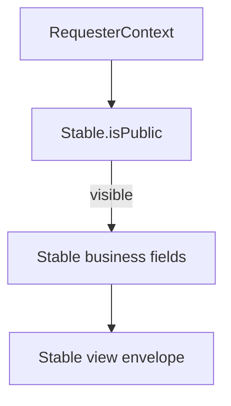

# Stables API (`/api/v1/stables`)

Reference for minimal stable endpoints and discovery visibility behavior.

Related:
- [equus/docs/features/userModule.md](../../features/userModule.md)
- [equus/docs/features/stableModule.md](../../features/stableModule.md) — full stable spec; §12 first-delivery SaaS backlog (`S-FD-*`)
- [equus/docs/product/firstDeliveryCompetitiveBacklog.md](../../product/firstDeliveryCompetitiveBacklog.md) — market extract (Equicty, HippoVibe, StallPros)
- [`../../equus/docs/product/benchMarket/webapps.md`](../../product/benchMarket/webapps.md) — competitive benchmark
- [`horses.md`](horses.md)
- [equus/docs/engineering/profile.md](../profile.md)

---

## Endpoints

| Method | Path | Purpose |
|--------|------|---------|
| `POST` | `/api/v1/stables` | Create a stable owned by the authenticated user (`mainOwnerUserId`) |
| `PATCH` | `/api/v1/stables/:id/discovery` | Update discovery settings (`isPublic`, `acceptsNewHorses`) for owner/co-owner |
| `GET` | `/api/v1/stables/:id` | **Unified role-aware stable view** — returns `{ viewerRole, allowedTabs, stable }`. Auth optional; visibility still returns 404 when discovery denies access. |

---

## Discovery visibility model

- `Stable.isPublic` (default `true`) controls whether the stable appears in anonymous discovery.
- When `isPublic: false`, the stable is visible only to owner/co-owner, active collaborators at the stable, or users with an accepted horse ↔ stable `Relationship`.
- Business contact (`tradeName`, `email`, `phoneNumber`) lives on the **entity** — not filtered through `User.preferences`. A private user may still operate a public stable listing.

---

## Nested entity payload fields

`GET /api/v1/stables/:id` returns the view envelope `{ viewerRole, allowedTabs, stable }`; clients use `getStableView` / `useStableView`. The nested `stable` payload contains the following fields:

- `id`, `tradeName`, `description`, `email`, `phoneNumber`
- `address: { city?, country?, state?, street?, postCode?, buildingNumber? }`
- `disciplines`, `services`, `acceptsNewHorses`, `isPublic`

Returns **404** when discovery rules deny access (same pattern as horses).

---

## Implementation

- Discovery rules: `lib/stables/stableDiscoveryAccess.ts`
- View DTO: `toStableView` / `getStableView` in `lib/services/stableService.ts`
- Service: `lib/services/stableService.ts`
- Validation: `lib/validations/stable.ts`

Collaboration and workplace APIs remain under `/api/v1/role-profiles/stable/:id/workplace-relationships`.
