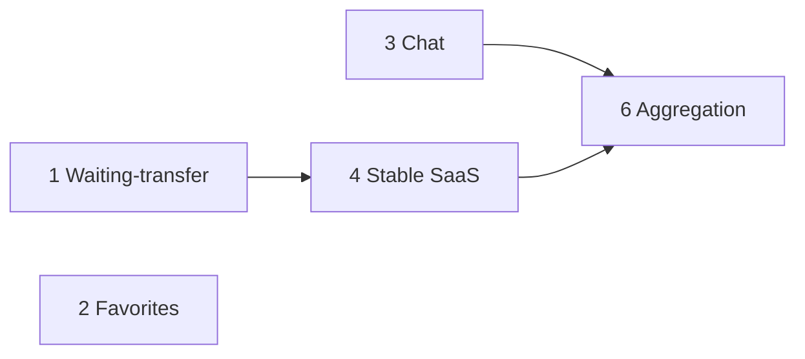

# Next features roadmap — specs & plans

Date: 2026-08-18  
Status: approved (grill session 2026-08-18)  
Predecessor: [`../plans/2026-08-17-shipped-work-review.md`](../plans/2026-08-17-shipped-work-review.md) §Suggested next-feature order

## Execution order

| # | Feature | Spec | Plan | Notes |
|---|---------|------|------|-------|
| 1 | Waiting-transfer + 3-day nag | [`2026-08-18-waiting-transfer-design.md`](2026-08-18-waiting-transfer-design.md) | [`../plans/2026-08-18-waiting-transfer.md`](../plans/2026-08-18-waiting-transfer.md) | Stable Path B horse create |
| 2 | Favorites | [`2026-08-18-favorites-design.md`](2026-08-18-favorites-design.md) | [`../plans/2026-08-18-favorites.md`](../plans/2026-08-18-favorites.md) | Horse + Stable only in v1 |
| 3 | Chat | [`2026-08-18-chat-design.md`](2026-08-18-chat-design.md) | [`../plans/2026-08-18-chat.md`](../plans/2026-08-18-chat.md) | REST first, then Socket.io |
| 4 | Stable SaaS ops | [`2026-08-18-stable-saas-ops-design.md`](2026-08-18-stable-saas-ops-design.md) | [`../plans/2026-08-18-stable-saas-ops.md`](../plans/2026-08-18-stable-saas-ops.md) | Umbrella + 6 sub-plans |
| 5 | Portuguese locale | — | — | **Deferred** — keep en/es |
| 6 | Entity-sourced aggregation | [`2026-08-18-entity-sourced-aggregation-design.md`](2026-08-18-entity-sourced-aggregation-design.md) | [`../plans/2026-08-18-entity-sourced-aggregation.md`](../plans/2026-08-18-entity-sourced-aggregation.md) | After stable ops can write |

### Stable SaaS sub-plans (under #4)

Execute in order after plan #4 umbrella is read:

1. [`../plans/2026-08-18-stable-saas-roster.md`](../plans/2026-08-18-stable-saas-roster.md)
2. [`../plans/2026-08-18-stable-saas-documents.md`](../plans/2026-08-18-stable-saas-documents.md)
3. [`../plans/2026-08-18-stable-saas-finance.md`](../plans/2026-08-18-stable-saas-finance.md)
4. [`../plans/2026-08-18-stable-saas-whiteboard.md`](../plans/2026-08-18-stable-saas-whiteboard.md)
5. [`../plans/2026-08-18-stable-saas-feed.md`](../plans/2026-08-18-stable-saas-feed.md)
6. [`../plans/2026-08-18-stable-saas-owner-portal.md`](../plans/2026-08-18-stable-saas-owner-portal.md)

## Cross-feature dependencies

- **Chat plan #3** owns Planning “reply” entry points (prefilled context text).
- **Aggregation plan #6** owns read surfaces only; depends on stable write APIs from #4.
- **Favorites** and **Chat** are independent of waiting-transfer but ship after it per agreed order.

## Global constraints (all plans)

- Work from `equus/`. REST `/api/v1/*`; business logic in `lib/services/`.
- UI calls API only — no direct `lib/services` from pages/components.
- Tests colocated in `__tests__/` per [`../../conventions/testing.md`](../../conventions/testing.md).
- Apply [`../../../../agents/senior-engineer.md`](../../../../agents/senior-engineer.md) on touched code roots.
- Update engineering docs when Shipped matches Target (`equus/docs/engineering/*.md`).
