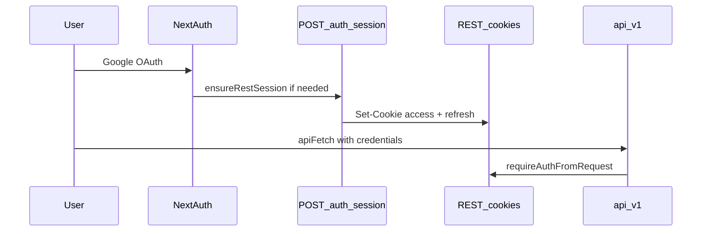

# Equus authentication (web + API)

The REST API under `/api/v1/` is the integration surface for all clients. Web and mobile share the same auth services; transport differs by client.

## Session truth by client

| Client | Session | Verified by |
|--------|---------|-------------|
| **Web** | httpOnly cookies `access_token` + `refresh_token` | `requireAuthFromRequest` on API routes |
| **Mobile (future)** | `Authorization: Bearer` access JWT | Same `requireAuthFromRequest` |

**Web rule:** UI auth state (`isAuthenticated`) comes from `GET /api/v1/auth/me` succeeding — never from NextAuth `useSession()` alone.

## Sign-in flows

### Email and password

1. `POST /api/v1/auth/login` (via `loginWithCredentials` in [`lib/api/authClient.ts`](../lib/api/authClient.ts))
2. Response sets REST cookies + returns user
3. No NextAuth involved

### Google

1. NextAuth Google OAuth ([`lib/auth/auth.ts`](../lib/auth/auth.ts)) — **transport only**
2. `findOrCreateFromGoogle` in sign-in callback
3. Client bridges to REST: `POST /api/v1/auth/session` (reads NextAuth server session, issues REST cookies)
4. Bridge runs **lazily** via `ensureRestSession()` when `/auth/me` returns 401 but NextAuth has a user id
5. [`GoogleSessionBridge`](../components/providers/google-session-bridge.tsx) bridges once early after OAuth redirect

## Client API (`lib/api/authClient.ts`)

| Function | Use |
|----------|-----|
| `ensureRestSession({ nextAuthUserId? })` | Load auth state; bridge from Google only when REST missing |
| `tryFetchCurrentUser()` | Optional probe on public pages (silent 401) |
| `fetchCurrentUser()` | Protected pages; throws if no REST session |
| `fetchUserProfile()` | `GET /api/v1/users/me` — full `PublicUser` for profile form |
| `createProfilePageDataPromise()` | Profile route — chains the two calls after client mount ([`profile.md`](./profile.md)) |
| `runWithSilentAuthFailure()` | Internal — no redirect on optional probes |
| `setSessionExpiredHandler()` | Registered by `AuthSessionProvider` — redirect + toast |

### Token refresh

`apiFetch` retries once on `401`: `POST /api/v1/auth/refresh` → retry original request.

Excluded from refresh retry: login, register, refresh, logout, **session bridge** (401 means no NextAuth session).

If refresh fails on a protected call, cache is cleared and the session-expired handler runs (redirect to sign-in).

## Logout

1. `POST /api/v1/auth/logout` — clears REST cookies
2. `signOut({ redirect: false })` if NextAuth session exists — clears Google OAuth cookie
3. Client navigates to `/signin`

## Server routes

- [`requireAuthFromRequest`](../lib/auth/requireAuth.ts) — Bearer header or `access_token` cookie
- [`establishSession`](../lib/auth/establishSession.ts) — issue tokens after login, register, refresh, bridge

## Related docs

- [profile.md](./profile.md) — profile page loading, save flow, `PATCH /me` clear-field semantics
- [i18n.md](./i18n.md) — locale cookie on auth responses
- [AGENTS.md](../AGENTS.md) — architecture overview
