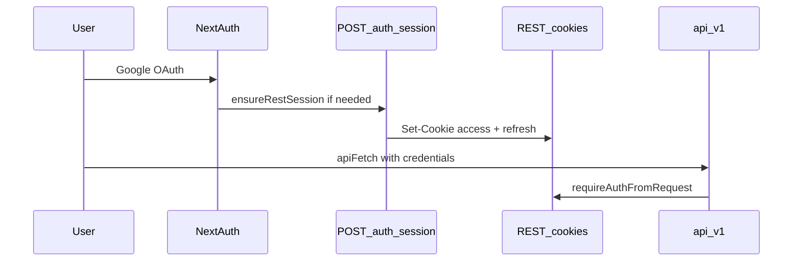

# Equus authentication (web + API)

The REST API under `/api/v1/` is the integration surface for all clients. Web and mobile share the same auth services; transport differs by client.

## Session truth by client

| Client | Session | Verified by |
|--------|---------|-------------|
| **Web** | httpOnly cookies `access_token` + `refresh_token` | `requireAuthFromRequest` on API routes |
| **Mobile (future)** | `Authorization: Bearer` access JWT | Same `requireAuthFromRequest` |

**Web rule:** UI auth state (`isAuthenticated`) comes from `GET /api/v1/auth/me` succeeding — never from NextAuth `useSession()` alone.

## Sign-in flows

### Email and password

1. `POST /api/v1/auth/login` (via `loginWithCredentials` in [`lib/api/auth/credentials.ts`](../lib/api/auth/credentials.ts))
2. Response sets REST cookies + returns user
3. No NextAuth involved
4. Web UI redirects to `/home` (user home) by default, or to a safe `?next=` path when present (`resolvePostAuthPath` / `buildSignInPath` in [`lib/navigation/postAuthRedirect.ts`](../lib/navigation/postAuthRedirect.ts)). `?next=` is omitted from the sign-in URL when the destination is already `/home`. `/` is the guest landing only; `/profile` is account settings, not the post-auth destination. Legacy `/me` URLs redirect to `/home`.

### Google

1. NextAuth Google OAuth ([`lib/auth/auth.ts`](../lib/auth/auth.ts)) — **transport only**
2. `findOrCreateFromGoogle` in sign-in callback
3. Client bridges to REST: `POST /api/v1/auth/session` (reads NextAuth server session, issues REST cookies)
4. Bridge runs from `AppAuthProvider` via `ensureRestSession({ nextAuthUserId })` when `/auth/me` returns 401
5. Protected client loaders use `fetchCurrentUser()` → `ensureRestSession({ attemptBridge: true })`

#### Credentials ↔ Google linking (UA-24)

| Scenario | Behavior |
|----------|----------|
| Google sign-in, email matches existing **credentials** user | **Link** — set `googleSubjectId` on that user; keep `authProvider: credentials` and password |
| Google sign-in, email linked to a **different** `googleSubjectId` | **Block** — `409 GOOGLE_ACCOUNT_MISMATCH` |
| Google sign-in, inactive / anonymized user | **Block** — `403 FORBIDDEN` |
| Register, email is **Google-only** (no password) | **Block** — `409 ACCOUNT_EXISTS_GOOGLE` |
| Register, email already exists (credentials or linked) | **Block** — `409 CONFLICT` |

Implementation: [`lib/auth/googleAccountLinking.ts`](../lib/auth/googleAccountLinking.ts), [`userService.findOrCreateFromGoogle`](../lib/services/userService.ts), [`authService.register`](../lib/services/authService.ts).

## Client API

Auth session state lives in `lib/api/auth/session.ts` — driven by an observer pattern, consumed via `useAppAuth()` context. Profile and navigation data are loaded via TanStack Query hooks, not auth context.

### Auth session (`lib/api/auth/session.ts`)

| Function | Use |
|----------|------|
| `ensureRestSession({ nextAuthUserId?, attemptBridge?, required? })` | Load auth state; bridge from Google when REST missing |
| `tryFetchCurrentUser()` | Optional probe on public pages (silent 401) |
| `fetchCurrentUser()` | Protected pages; bridges then throws if still unauthenticated |
| `runWithSilentAuthFailure()` | Internal — no redirect on optional probes |
| `setSessionExpiredHandler()` | Registered by `AuthSessionProvider` — redirect + toast |
| `resetOptionalUserCache(notify?)` | Clear in-memory auth cache; triggers re-probe on next access |
| `refreshAccessToken()` | POST `/api/v1/auth/refresh` — deduped via shared `refreshInFlight` |

### Credential auth flows (`lib/api/auth/credentials.ts`)

| Function | Use |
|----------|------|
| `loginWithCredentials(email, password)` | POST `/api/v1/auth/login` — sets REST cookies |
| `registerWithCredentials(input)` | POST `/api/v1/auth/register` |
| `confirmEmail(token)` | POST `/api/v1/auth/confirm-email` |
| `requestPasswordReset(email)` | POST `/api/v1/auth/request-password-reset` |
| `resetPassword(token, newPassword)` | POST `/api/v1/auth/reset-password` |

### Profile CRUD (`lib/api/auth/profile.ts`)

| Function | Use |
|----------|------|
| `updateUserProfile(input, imageFile?)` | PATCH `/api/v1/users/me` (JSON or multipart) |
| `deactivateCurrentUserAccount()` | DELETE `/api/v1/users/me` — tombstone account |

### TanStack Query hooks

| Hook | Endpoint | File |
|------|----------|------|
| `useUserProfile()` | `GET /api/v1/users/me` — full `PublicUser` for profile form, user menu, user home | `hooks/queries/useCurrentUser.ts` |
| `useUserNavigation()` | `GET /api/v1/users/me/navigation` — sidebar navigation links | `hooks/queries/useCurrentUser.ts` |

**Rule:** Auth state in context (`useAppAuth()`), async server data in TanStack hooks. Never put profile or navigation in auth context.

### Token refresh

`apiFetch` retries once on `401`: `POST /api/v1/auth/refresh` → retry original request.

Excluded from refresh retry: login, register, refresh, logout, **session bridge**, **`/auth/me`** (optional probe uses direct fetch; skips refresh when no access cookie).

If refresh fails on a protected call, cache is cleared and the session-expired handler runs (redirect to sign-in).

**Deactivated accounts:** `POST /api/v1/auth/refresh` rejects inactive users (`isActive: false`) via `establishSession` → `buildAuthUserSessionFromUserId`, even when the refresh token version still matches the DB. Account deactivation (`DELETE /api/v1/users/me`) also bumps `refreshSessionVersion`, so existing refresh tokens fail on version mismatch as well. **`requireAuthFromRequest`** performs a live `User.isActive` check after JWT verify, so surviving access tokens cannot call protected routes once the account is deactivated.

**Activity timestamps:** `lastLoginAt` is set on credential login (`authService.validateCredentials`). `lastActiveAt` is bumped from `requireAuthFromRequest` via [`touchUserLastActiveAt`](../lib/auth/touchUserLastActive.ts) — fire-and-forget, throttled to at most one write per user every five minutes. Optional-auth routes (`readOptionalAuthFromRequest`) do not touch activity.

Optional `ensureRestSession` probes return `null` without redirecting when the session is missing. Only `required: true` (protected flows) triggers the session-expired handler. Anonymous visitors are cached (`optionalUserCache === null`) so the app issues one `/auth/me` probe per load, not one per component.

Web auth loads once in [`AppAuthProvider`](../components/providers/app-auth-provider.tsx) — header, home (`/`), user home (`/home`), and banners share the same state via `useAppAuth()`.

Status pages (404, not-allowed, error recovery) use [`AuthAwareStatusActions`](../components/status/auth-aware-status-actions.tsx) — sign-in is hidden when a session exists. Sign-in and sign-up pages use [`useRedirectIfAuthenticated`](../hooks/use-redirect-if-authenticated.ts) to skip auth forms when already logged in.

## Logout

1. Client navigates to `/` (guest landing) **first** — leaves `/home` before auth state clears
2. `signOut({ redirect: false })` if NextAuth session exists — clears Google OAuth cookie (before REST logout so the client does not re-bridge)
3. `POST /api/v1/auth/logout` — clears REST cookies; session-expired redirect is **suppressed** during this step (`runWithSuppressedSessionExpired` in [`clearClientAuthSession`](../lib/auth/clearClientAuthSession.ts))

Sign-out must never land on `/signin` — only the guest home `/`.

## Server routes

- [`requireAuthFromRequest`](../lib/auth/requireAuth.ts) — Bearer header or `access_token` cookie; touches `lastActiveAt` when stale
- [`touchUserLastActiveAt`](../lib/auth/touchUserLastActive.ts) — throttled `lastActiveAt` persistence
- [`establishSession`](../lib/auth/establishSession.ts) — issue tokens after login, register, refresh, bridge

## Related docs

- [profile.md](./profile.md) — profile page loading, save flow, `PATCH /me` clear-field semantics
- [i18n.md](./i18n.md) — locale cookie on auth responses
- [AGENTS.md](../AGENTS.md) — architecture overview
