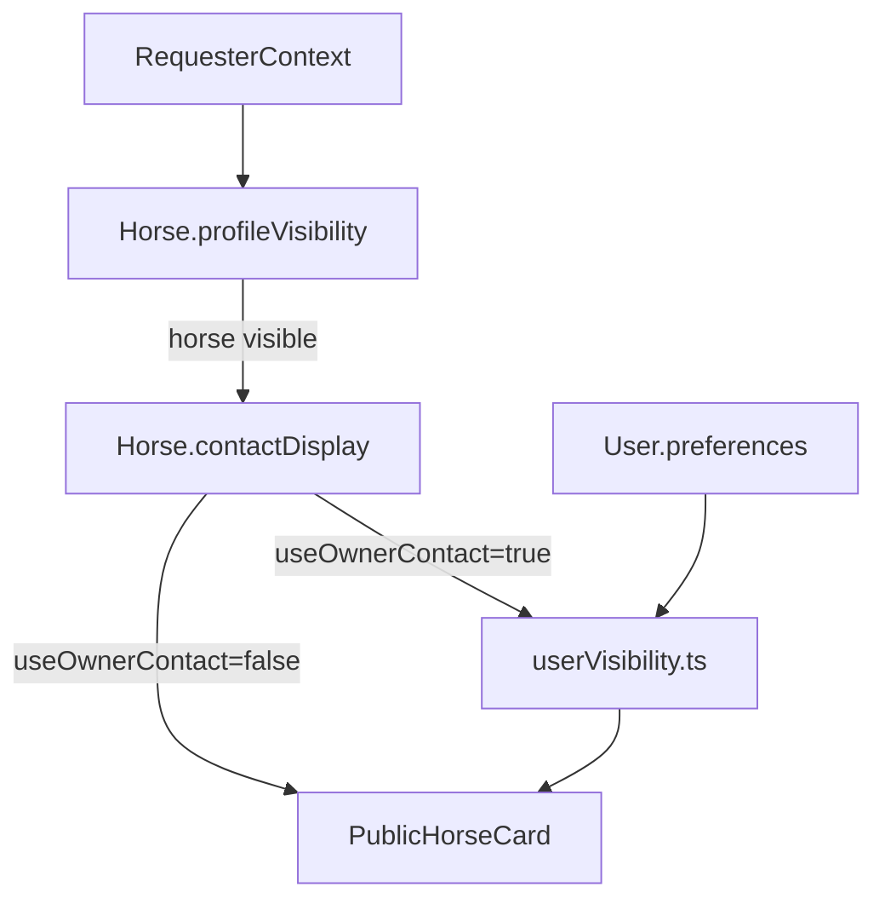

# Horses API (`/api/v1/horses`)

Reference for minimal horse endpoints and discovery visibility behavior.

Related:
- [`../../documentation/userModule.md`](../../documentation/userModule.md)
- [`../../documentation/horseModule.md`](../../documentation/horseModule.md) — full horse module spec (timeline, health, subscription, etc.)
- [`../../documentation/stableModule.md`](../../documentation/stableModule.md) — barn operations on hosted horses
- [`stables.md`](./stables.md)
- [`breeders.md`](./breeders.md)
- [`profile.md`](./profile.md)

---

## Endpoints

| Method | Path | Purpose |
|--------|------|---------|
| `POST` | `/api/v1/horses` | Create a horse owned by the authenticated user (`mainOwnerUserId`, `createdByUserId`) |
| `GET` | `/api/v1/horses/:id/owner` | Owner-only horse summary (name, breed, sex) for hub UI |
| `GET` | `/api/v1/horses/:id/relationships?status=pending` | Outbound pending invites sent by the owner for this horse |
| `PATCH` | `/api/v1/horses/:id/discovery` | Update discovery visibility/contact (`profileVisibility`, `contactDisplay`) for owner/co-owner |
| `GET` | `/api/v1/horses/:id` | Return public horse card filtered by horse visibility and user privacy policy |

---

## Two-layer visibility model

- `Horse.profileVisibility` controls whether the horse is visible (`public`, `relationship`, `owner_only`).
- `Horse.contactDisplay` controls whether contact comes from owner or delegate.
- When `useOwnerContact: true`, owner identity/contact is filtered by `User.preferences` policy.

---

## Contact resolution rules

1. If `contactDisplay.useOwnerContact === false`, delegate fields are used directly.
2. If `useOwnerContact === true`, owner contact is mapped through `lib/privacy/userVisibility.ts`.
3. Private owner profiles can still operate public horses; contact fields may be omitted based on requester audience.

---

## Web UI

### Create horse

Authenticated create flow at `/create/horse` (locale-prefixed for `es`):

- Page: `app/[locale]/create/horse/page.tsx` — `Suspense` + skeleton
- Components: `components/horses/create-horse-page-content.tsx`, `create-horse-form.tsx`, `create-horse-page-skeleton.tsx`
- Client API: `lib/api/horseClient.ts` (`createHorse` → `POST /api/v1/horses`; clears navigation cache on success)
- Form schema / mapping: `lib/validations/horseForms.ts`, `lib/utils/horseFormMapping.ts`
- i18n: `messages/en.json` and `messages/es.json` (`createHorse` namespace)

On success the UI toasts and redirects to `/my/horses/{horseId}`. Discovery fields (`profileVisibility`, `contactDisplay`) are optional on create; defaults match the API (`public`, owner contact).

### Owner hub (`/my/horses/[horseId]`)

Minimal owner hub after create (or direct URL):

- Page: `app/[locale]/my/horses/[horseId]/page.tsx` — `Suspense` + skeleton
- Components: `components/horses/horse-hub-page-content.tsx`, `horse-hub-page-skeleton.tsx`
- Invites: `components/invites/horse-provider-invites.tsx` → `provider-invite-picker.tsx` (one picker per provider type, grouped Hosting / Care / Training)
- Client APIs:
  - `fetchHorseForOwner` → `GET /api/v1/horses/:id/owner`
  - `fetchPendingSentRelationships` → `GET /api/v1/horses/:id/relationships?status=pending`
  - `searchProviders` (`lib/api/discoverClient.ts`) → `GET /api/v1/discover/providers?type=&q=&scope=horse`
  - `createRelationshipInvite` (`lib/api/relationshipClient.ts`) → `POST /api/v1/relationships`
- i18n: `horseHub` and `invites.horseProviders` namespaces

Auth gate: non-owners receive 403 and redirect to `/not-allowed`. Pending invite state on the hub uses **outbound** sent invites (not the receiver inbox at `/users/me/relationships`).

See [`relationships.md`](./relationships.md) for invitation policy and discover endpoint details.

