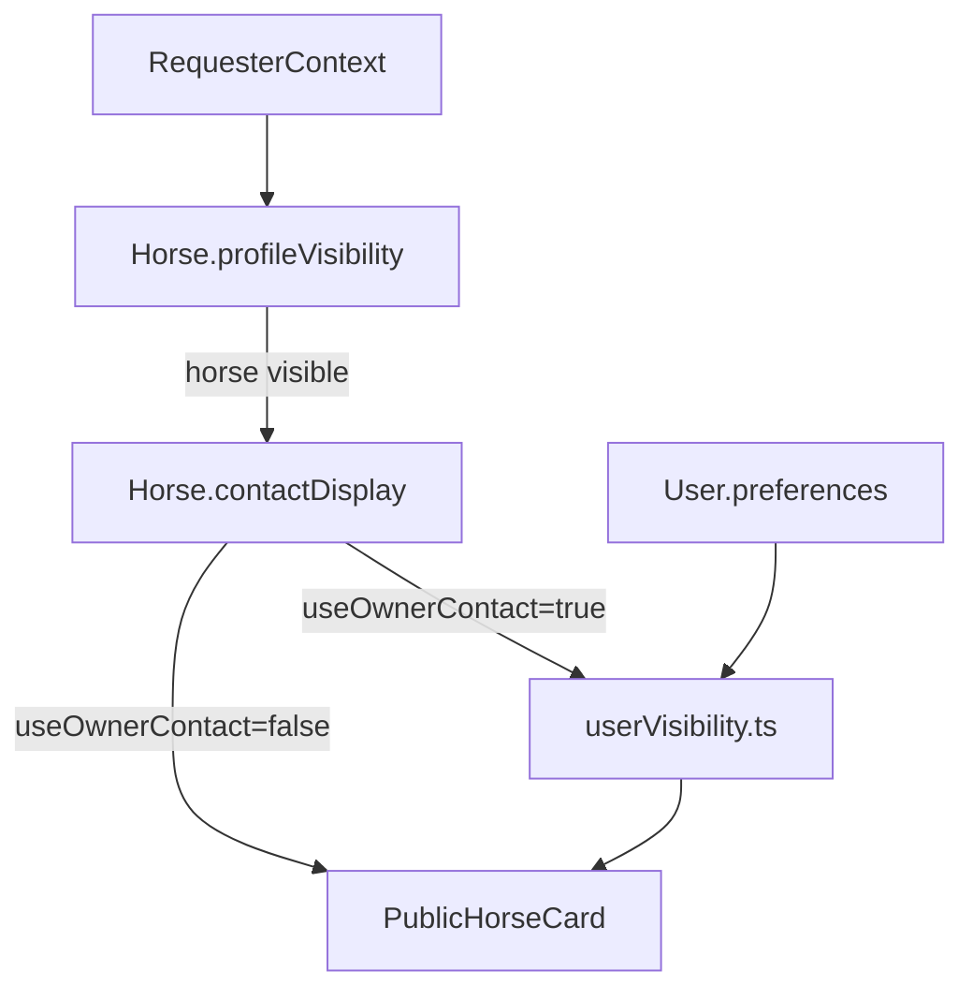

# Horses API (`/api/v1/horses`)

Reference for minimal horse endpoints and discovery visibility behavior.

Related:
- [`../../documentation/userModule.md`](../../documentation/userModule.md)
- [`../../documentation/horseModule.md`](../../documentation/horseModule.md) — full horse module spec (timeline, health, subscription, etc.)
- [`../../documentation/stableModule.md`](../../documentation/stableModule.md) — barn operations on hosted horses
- [`stables.md`](./stables.md)
- [`breeders.md`](./breeders.md)
- [`profile.md`](./profile.md)

---

## Endpoints

| Method | Path | Purpose |
|--------|------|---------|
| `GET` | `/api/v1/horses?mine=true&page=1&limit=20` | List horses — optional auth; `mine` filters to owned/co-owned for authenticated users; returns public horses for guests |
| `POST` | `/api/v1/horses` | Create a horse owned by the authenticated user (`mainOwnerUserId`, `createdByUserId`) |
| `GET` | `/api/v1/horses/:id/owner` | Owner-only horse summary (name, breed, sex) for hub UI |
| `GET` | `/api/v1/horses/:id/relationships?status=pending` | Outbound pending invites sent by the owner for this horse |
| `PATCH` | `/api/v1/horses/:id/discovery` | Update discovery visibility/contact (`profileVisibility`, `contactDisplay`) for owner/co-owner |
| `GET` | `/api/v1/horses/:id` | Return public horse card filtered by horse visibility and user privacy policy |

---

## Two-layer visibility model

- `Horse.profileVisibility` controls whether the horse is visible (`public`, `relationship`, `owner_only`).
- `Horse.contactDisplay` controls whether contact comes from owner or delegate.
- When `useOwnerContact: true`, owner identity/contact is filtered by `User.preferences` policy.

---

## Contact resolution rules

1. If `contactDisplay.useOwnerContact === false`, delegate fields are used directly.
2. If `useOwnerContact === true`, owner contact is mapped through `lib/privacy/userVisibility.ts`.
3. Private owner profiles can still operate public horses; contact fields may be omitted based on requester audience.

---

## Web UI

### Horse list (`/horses`)

Role-aware page at `/horses`:

- **Authenticated users** — see their owned/co-owned horses sorted by most recently updated, plus a link to add a new horse
- **Guests** — see public horses with `profileVisibility: "public"`
- Page: `app/[locale]/horses/page.tsx` — `Suspense` + `HorseListPageSkeleton`
- Components: `components/horses/horse-list-page.tsx`, `horse-card.tsx`, `horse-list-page-skeleton.tsx`
- Hook: `useHorseList({ mine, page, limit })` → `GET /api/v1/horses`
- i18n: `horsesList` namespace (title, description, addHorse, noResults, pagination, filter labels)
- Shared filter: `components/shared/entity-filter.tsx` (reusable filter bar with text, select, flag-select, toggle, and range fields)

Each card links to `/horses/{horseId}` (the role-aware hub page). Filter controls (breed, sex, location) update the URL as the single source of truth.

### Create horse

Authenticated create flow at `/horses/new` (locale-prefixed for `es`). The form follows the same component structure as the profile page (`profile-form.tsx`).

**Form sections (top to bottom):**
1. **Media** — profile photo (`ProfilePhotoField` from `components/shared/`), gallery (`FileUpload` from `components/shared/`), description, notes
2. **Horse identity** — name, registeredName, breed, sex, dateOfBirth, ageYears, color, heightHands, primaryDiscipline, disciplines (multi-select), registryId, microchipId, passportNumber, marksDescription, countryOfBirth, importExportStatus
3. **Commercial** — estimatedValue, valueCurrency, saleStatus, askingPrice, acquisitionDate, acquisitionSource, showValuePublicly
4. **Pedigree** — sireName, sireId, damName, damId, bloodlineNotes
5. **Discovery** — profileVisibility, useOwnerContact, conditional contact fields

**Upload flow:** Files (profile photo + gallery) are uploaded first via `POST /api/v1/media/upload` → Cloudinary URLs. The horse is then created via `POST /api/v1/horses` as JSON with those URLs included as `profileImageUrl` and `gallery`.

**Files:**
- Page: `app/[locale]/horses/new/page.tsx` — `Suspense` + skeleton
- Components: `components/horses/create-horse-page-content.tsx`, `create-horse-form.tsx`, `create-horse-page-skeleton.tsx`
- Shared components: `components/shared/profile-photo-field.tsx`, `components/shared/file-upload.tsx`
- Validation: `lib/validations/horse.ts`, `lib/validations/horseForms.ts`
- Breed enum: `utils/enums.ts` (`horseBreedEnums` — 51 breeds, used by model validation and form select)
- Form mapping: `lib/utils/horseFormMapping.ts` (maps all fields + media URLs)
- Service: `lib/services/horseService.ts` (persists all fields)
- Upload endpoint: `app/api/v1/media/upload/route.ts` (accepts multipart, uploads to Cloudinary)
- i18n: `messages/en.json` and `messages/es.json` (`createHorse` namespace with field labels, section titles, option enums, photo labels)

On success the UI toasts and redirects to `/horses/{horseId}`. Discovery fields (`profileVisibility`, `contactDisplay`) are optional on create; defaults match the API (`public`, owner contact).

### Horse hub (`/horses/[horseId]`)

Minimal owner hub after create (or direct URL):

- Page: `app/[locale]/horses/[horseId]/page.tsx` — `Suspense` + skeleton
- Components: `components/horses/horse-hub-page-content.tsx`
- Invites: `components/invites/horse-provider-invites.tsx` → `provider-invite-picker.tsx` (one picker per provider type, grouped Hosting / Care / Training)
- Client APIs:
  - `fetchHorseForOwner` → `GET /api/v1/horses/:id/owner`
  - `fetchPendingSentRelationships` → `GET /api/v1/horses/:id/relationships?status=pending`
  - `searchProviders` (`lib/api/discoverClient.ts`) → `GET /api/v1/discover/providers?type=&q=&scope=horse`
  - `createRelationshipInvite` (`lib/api/relationshipClient.ts`) → `POST /api/v1/relationships`
- i18n: `horseHub` and `invites.horseProviders` namespaces

Auth gate: non-owners receive 403 and redirect to `/not-allowed`. Pending invite state on the hub uses **outbound** sent invites (not the receiver inbox at `/users/me/relationships`).

See [`relationships.md`](./relationships.md) for invitation policy and discover endpoint details.

