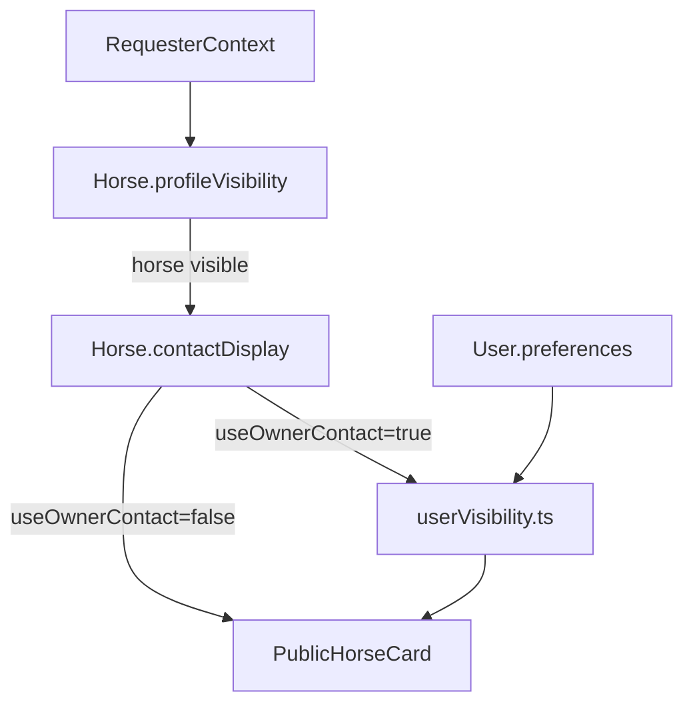

# Horses API (`/api/v1/horses`)

Reference for minimal horse endpoints and discovery visibility behavior.

Related:
- [`../../documentation/userAndRoles.md`](../../documentation/userAndRoles.md)
- [`../../documentation/horseModule.md`](../../documentation/horseModule.md) — full horse module spec (timeline, health, subscription, etc.)
- [`../../documentation/stableModule.md`](../../documentation/stableModule.md) — barn operations on hosted horses
- [`stables.md`](./stables.md)
- [`breeders.md`](./breeders.md)
- [`profile.md`](./profile.md)

---

## Endpoints

| Method | Path | Purpose |
|--------|------|---------|
| `POST` | `/api/v1/horses` | Create a horse owned by the authenticated user (`mainOwnerUserId`, `createdByUserId`) |
| `PATCH` | `/api/v1/horses/:id/discovery` | Update discovery visibility/contact (`profileVisibility`, `contactDisplay`) for owner/co-owner |
| `GET` | `/api/v1/horses/:id` | Return public horse card filtered by horse visibility and user privacy policy |

---

## Two-layer visibility model

- `Horse.profileVisibility` controls whether the horse is visible (`public`, `relationship`, `owner_only`).
- `Horse.contactDisplay` controls whether contact comes from owner or delegate.
- When `useOwnerContact: true`, owner identity/contact is filtered by `User.preferences` policy.

---

## Contact resolution rules

1. If `contactDisplay.useOwnerContact === false`, delegate fields are used directly.
2. If `useOwnerContact === true`, owner contact is mapped through `lib/privacy/userVisibility.ts`.
3. Private owner profiles can still operate public horses; contact fields may be omitted based on requester audience.

