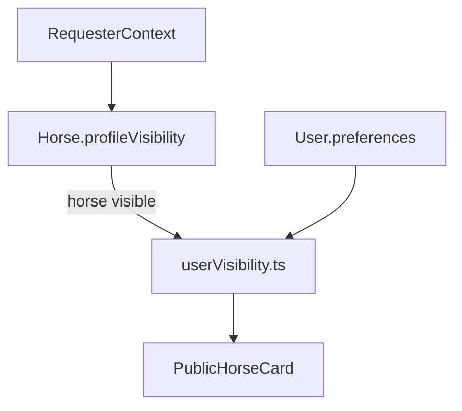

# Horses API (`/api/v1/horses`)

Reference for minimal horse endpoints and discovery visibility behavior.

Related:
- [`../../documentation/userModule.md`](../../documentation/userModule.md) — includes §12 first-delivery social backlog (`U-FD-*`)
- [`../../documentation/horseModule.md`](../../documentation/horseModule.md) — full horse module spec; §14 first-delivery social backlog (`H-FD-*`)
- [`../../documentation/stableModule.md`](../../documentation/stableModule.md) — barn operations on hosted horses; §12 first-delivery SaaS backlog (`S-FD-*`)
- [`../../documentation/firstDeliveryCompetitiveBacklog.md`](../../documentation/firstDeliveryCompetitiveBacklog.md) — market extract for first delivery
- [`../../documentation/appCompetition/webapps.md`](../../documentation/appCompetition/webapps.md) — competitive benchmark
- [`stables.md`](./stables.md)
- [`breeders.md`](./breeders.md)
- [`profile.md`](./profile.md)

---

## Endpoints

| Method | Path | Purpose |
|--------|------|---------|
| `GET` | `/api/v1/horses?mine=true&page=1&limit=20` | List horses — optional auth; `mine` filters to owned/co-owned for authenticated users; returns public horses for guests |
| `POST` | `/api/v1/horses` | Create a horse owned by the authenticated user (`mainOwnerUserId`, `createdByUserId`) |
| `GET` | `/api/v1/horses/:id/owner` | Owner-only horse summary (name, breed, sex) for hub UI |
| `GET` | `/api/v1/horses/:id/relationships?status=pending` | Outbound pending invites sent by the owner for this horse |
| `PATCH` | `/api/v1/horses/:id/discovery` | Update discovery visibility (`profileVisibility`) for owner/co-owner |
| `GET` | `/api/v1/horses/:id` | Return public horse card filtered by horse visibility and user privacy policy |
| `GET` | `/api/v1/horses/:id/media` | List media items (images/videos) for a horse |
| `POST` | `/api/v1/horses/:id/media` | Create a media record (url, type, title, etc.) |
| `DELETE` | `/api/v1/horses/:id/media/:mediaId` | Delete a media record + Cloudinary file (owner only, hard-delete) |
| `GET` | `/api/v1/horses/:id/media-deletion-requests?status=pending` | List pending deletion requests (owner/co-owner only) |
| `POST` | `/api/v1/horses/:id/media-deletion-requests` | Request deletion of a media item (non-owners) — creates pending request for owner approval |
| `PATCH` | `/api/v1/horses/:id/media-deletion-requests/:requestId` | Approve or decline a deletion request (owner/co-owner only) |
| `DELETE` | `/api/v1/horses/:id/media-deletion-requests/:requestId` | Cancel own pending deletion request (requester only) |

---

## Two-layer visibility model

```mermaid
flowchart TB
  requester[RequesterContext]
  horseRules[Horse.profileVisibility]
  userPrefs[User.preferences]
  privacyPolicy[userVisibility.ts]
  publicCard[PublicHorseCard]

  requester --> horseRules
  horseRules -->|"horse visible"| privacyPolicy
  userPrefs --> privacyPolicy
  privacyPolicy --> publicCard
```

- `Horse.profileVisibility` controls whether the horse Hub / public card is visible (`public`, `relationship`, `owner_only`).
- Public contact always comes from the main owner, filtered by `User.preferences` via `lib/privacy/userVisibility.ts`.

---

## Contact resolution rules

1. Public horse cards resolve contact from the main owner only.
2. Owner identity/contact is mapped through `lib/privacy/userVisibility.ts`.
3. Private owner profiles can still operate public horses; contact fields may be omitted based on requester audience.

---

## Web UI

### Horse list (`/horses`)

Role-aware page at `/horses`:

- **Authenticated users** — see their owned/co-owned horses sorted by most recently updated, plus a link to add a new horse
- **Guests** — see public horses with `profileVisibility: "public"`
- Page: `app/[locale]/horses/page.tsx` — `Suspense` + `HorseListPageSkeleton`
- Components: `components/horses/horse-list-page.tsx`, `horse-card.tsx`, `horse-list-page-skeleton.tsx`
- Hook: `useHorseList({ mine, page, limit })` → `GET /api/v1/horses`
- i18n: `horsesList` namespace (title, description, addHorse, noResults, pagination, filter labels)
- Shared filter: `components/shared/entity-filter.tsx` (reusable filter bar with text, select, flag-select, toggle, and range fields)

Each card links to `/horses/{horseId}` (the role-aware hub page). Filter controls (breed, sex, location) update the URL as the single source of truth.

### Create horse

Authenticated create flow at `/horses/new` (locale-prefixed for `es`). The form follows the same component structure as the profile page (`profile-form.tsx`).

**Form sections (top to bottom):**
1. **Media** — profile photo (`ProfilePhotoField` from `components/shared/`), gallery (`FileUpload` from `components/shared/`), description, notes
2. **Horse identity** — name, registeredName, breed, sex, dateOfBirth, color, heightHands, primaryDiscipline, disciplines (multi-select), registryId, microchipId, passportNumber, countryOfBirth
3. **Commercial** — estimatedValue, valueCurrency, saleStatus, askingPrice, acquisitionDate, acquisitionSource, showValuePublicly
4. **Pedigree** — sireName, damName, bloodlineNotes (sireHorseId/damHorseId set via consent-based connections)
5. **Discovery** — profileVisibility

**Upload flow:** Files (profile photo + gallery) are uploaded first via `POST /api/v1/media/upload` → Cloudinary URLs. The horse is then created via `POST /api/v1/horses` as JSON with those URLs included as `profileImageUrl` and `gallery`.

**Files:**
- Page: `app/[locale]/horses/new/page.tsx` — `Suspense` + skeleton
- Components: `components/horses/create-horse-page-content.tsx`, `create-horse-form.tsx`, `create-horse-page-skeleton.tsx`
- Shared components: `components/shared/profile-photo-field.tsx`, `components/shared/file-upload.tsx`
- Validation: `lib/validations/horse.ts`, `lib/validations/horseForms.ts`
- Breed enum: `utils/enums.ts` (`horseBreedEnums` — 51 breeds, used by model validation and form select)
- Form mapping: `lib/utils/horseFormMapping.ts` (maps all fields + media URLs)
- Service: `lib/services/horseService.ts` (persists all fields)
- Upload endpoint: `app/api/v1/media/upload/route.ts` (accepts multipart, uploads to Cloudinary)
- i18n: `messages/en.json` and `messages/es.json` (`createHorse` namespace with field labels, section titles, option enums, photo labels)

On success the UI toasts and redirects to `/horses/{horseId}`. Discovery (`profileVisibility`) is optional on create; default is `public`.

### Horse hub (`/horses/[horseId]`)

Owner hub after create (or direct URL). Admins see **Discovery** at the top (controls Hub / public visibility), then overview content.

- Page: `app/[locale]/horses/[horseId]/page.tsx`
- Components: `components/horses/horse-hub-page-content.tsx`
- Discovery: `components/horses/profile/discovery-section.tsx` + `useUpdateHorseDiscovery`
- Invites: `components/invites/horse-provider-invites.tsx` → `provider-invite-picker.tsx` (one picker per provider type, grouped Hosting / Care / Training)
- Client APIs:
  - `fetchHorseForOwner` → `GET /api/v1/horses/:id/owner`
  - `fetchPendingSentRelationships` → `GET /api/v1/horses/:id/relationships?status=pending`
  - `searchProviders` (`lib/api/discoverClient.ts`) → `GET /api/v1/discover/providers?type=&q=&scope=horse`
  - `createRelationshipInvite` (`lib/api/relationshipClient.ts`) → `POST /api/v1/relationships`
- i18n: `horseHub` and `invites.horseProviders` namespaces

Auth gate: non-owners receive 403 and redirect to `/not-allowed`. Pending invite state on the hub uses **outbound** sent invites (not the receiver inbox at `/users/me/relationships`).

See [`relationships.md`](./relationships.md) for invitation policy and discover endpoint details.

### Horse profile (`/horses/[horseId]/profile`)

Deferred edit form for identity, identification, disciplines, pedigree, and about (not discovery).

Pedigree sire/dam linking uses **PedigreeConnection** acknowledgment (not ownership transfer). See [`pedigreeConnections.md`](./pedigreeConnections.md). Registry / microchip / passport are optional at horse **create**; at least one is required when saving the horse **profile**. When set, each is uniquely indexed.

- Assembly: `app/[locale]/horses/[horseId]/profile/client.tsx` — parent owns one `useForm` + single Save
- Field sections under `components/horses/profile/` receive `control` only (no per-section Save)
- Patches: `lib/utils/horseProfilePatch.ts` — dirty-field horse patch
- Hooks: `useUpdateHorse`
- Unsaved navigation: `UnsavedChangesProvider` in `HorsePageShell` + tab intercept in `EntityTabs`
- Pattern: [`page-flow-blueprint.md`](./page-flow-blueprint.md) §6.5

### Horse admin (`/horses/[horseId]/admin`)

Owner-only tab. Sale settings use the same deferred-form pattern as Profile; ownership/responsible sections use immediate actions.

- Assembly: `app/[locale]/horses/[horseId]/admin/client.tsx` — parent owns sale `useForm` + single Save
- Sale fields: `components/horses/ownership/horse-value-section.tsx` (`control` only)
- Sale patches: `lib/utils/horseSalePatch.ts` → `useUpdateHorseSale`
- Action sections (own mutations): admin history, co-owners, proactive representatives, ownership transfer
- Same unsaved-changes guard as Profile when sale fields are dirty
- Pattern: [`page-flow-blueprint.md`](./page-flow-blueprint.md) §6.5

### Horse media (`/horses/[horseId]/media`)

Media gallery with drag-and-drop upload. Two-section layout: upload section on top, thumbnail gallery below.

- Server component: `app/[locale]/horses/[horseId]/media/page.tsx`
- Client assembly: `app/[locale]/horses/[horseId]/media/client.tsx`
- Upload component: `components/horses/media/media-upload-section.tsx` — wraps shared `FileUpload` with Cloudinary upload + HorseMedia record creation
- Gallery component: `components/horses/media/media-gallery-section.tsx` — thumbnail grid + lightbox dialog + delete
- Hooks: `hooks/queries/useHorseMedia.ts` — `useHorseMedia`, `useUploadHorseMedia`, `useDeleteHorseMedia`
- Service: `lib/services/horseMediaService.ts` — `listMedia`, `createMedia`, `deleteMedia`, `extractStoragePublicId`
- Model: `models/HorseMedia.ts` — `type` (image/video), `url`, `thumbnailUrl`, `sourceEntityType`, `sourceEntityId`, `visibilityMode`
- Upload: `POST /api/v1/horses/:id/media/upload` (multipart + Cloudinary folder + record creation)
- i18n: `horseMedia` namespace

**Cloudinary folder structure:** `horses/{horseId}/media/{sourceEntityType}/`
**Visibility rule:** Owner-uploaded media defaults to public; entity-uploaded media defaults to owner-only.

### Deletion policy (Media and Documents)

**Direct delete** (hard-delete Cloudinary + MongoDB): main owner, co-owner, or proactive representative (`ownedByUserQuery` / `userOwnsEntity`).

**Deletion requests (non-admins):** Vets, trainers, and other non-admins cannot directly delete. They create a request:

| Asset | Create | Decide | Cancel |
|-------|--------|--------|--------|
| Media | `POST /api/v1/horses/:id/media-deletion-requests` | `PATCH .../media-deletion-requests/:requestId` | `DELETE` (requester) |
| Documents | `POST /api/v1/horses/:id/document-deletion-requests` | `PATCH .../document-deletion-requests/:requestId` | `DELETE` (requester) |

**Decision recipients** (`getDeletionDecisionRecipients`): if the horse has any `responsibles[]`, only those users are notified and may approve/decline; otherwise main owner and co-owners.

**Audit:** `MediaDeletionRequest` / `DocumentDeletionRequest` rows remain (status lifecycle); request records are not hard-deleted.

### Horse documents (`/horses/[horseId]/documents`)

- Upload: `POST /api/v1/horses/:id/documents/upload` (multipart + Cloudinary + `Document` record)
- List: `GET /api/v1/horses/:id/documents`
- Delete (admin): `DELETE /api/v1/horses/:id/documents/:docId` — Cloudinary destroy + hard-delete MongoDB
- UI: `ConfirmActionDialog` / `ConfirmDeleteDialog` before delete; shared with Media / Admin History
- Service: `lib/services/horseDocumentService.ts`
- Deletion requests: `lib/services/documentDeletionService.ts`
- i18n: `horseDocuments` namespace

**Cloudinary folder:** `equus/horses/{horseId}/documents/`

