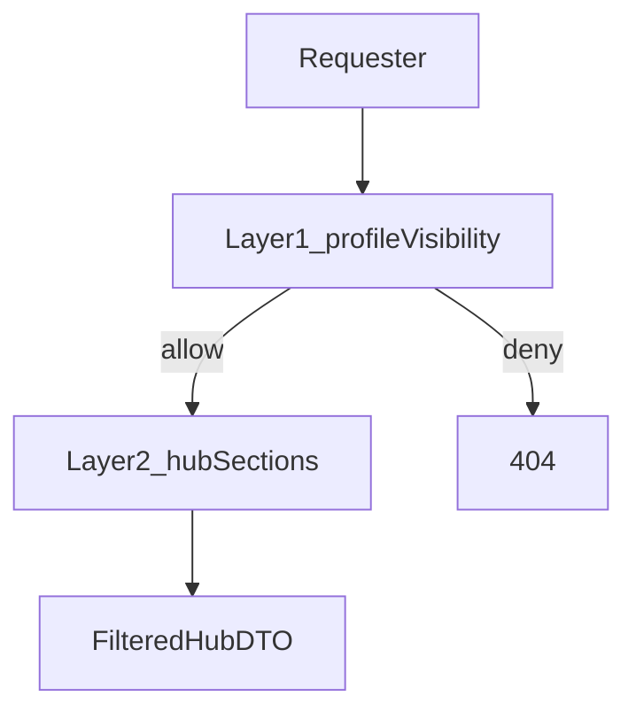

# Horses API (`/api/v1/horses`)

Reference for minimal horse endpoints and discovery visibility behavior.

Related:
- [`../../documentation/userModule.md`](../../documentation/userModule.md) — includes §12 first-delivery social backlog (`U-FD-*`)
- [`../../documentation/horseModule.md`](../../documentation/horseModule.md) — full horse module spec; §14 first-delivery social backlog (`H-FD-*`)
- [`../../documentation/stableModule.md`](../../documentation/stableModule.md) — barn operations on hosted horses; §12 first-delivery SaaS backlog (`S-FD-*`)
- [`../../documentation/firstDeliveryCompetitiveBacklog.md`](../../documentation/firstDeliveryCompetitiveBacklog.md) — market extract for first delivery
- [`../../documentation/appCompetition/webapps.md`](../../documentation/appCompetition/webapps.md) — competitive benchmark
- [`stables.md`](./stables.md)
- [`breeders.md`](./breeders.md)
- [`profile.md`](./profile.md)

---

## Endpoints

| Method | Path | Purpose |
|--------|------|---------|
| `GET` | `/api/v1/horses?mine=true&page=1&limit=20` | List horses — optional auth; `mine` filters to owned/co-owned for authenticated users; returns public horses for guests |
| `POST` | `/api/v1/horses` | Create a horse owned by the authenticated user (`mainOwnerUserId`, `createdByUserId`) |
| `GET` | `/api/v1/horses/:id/owner` | Owner-only horse summary (name, breed, sex) for hub UI |
| `GET` | `/api/v1/horses/:id/relationships?status=pending` | Outbound pending invites sent by the owner for this horse |
| `PATCH` | `/api/v1/horses/:id/discovery` | Layer-1 `profileVisibility` only (Admin Visibility form Save) |
| `PATCH` | `/api/v1/horses/:id/hub-sections` | Layer-2 partial `hubSections` (section popover autosave) |
| `GET` | `/api/v1/horses/:id` | Public horse card (list/contact) — Layer 1 only |
| `GET` | `/api/v1/horses/:id/hub` | Filtered Hub DTO — Layer 1 gate + Layer 2 section filter (auth optional) |
| `PATCH` | `/api/v1/horses/:id` | Owner profile field patch (not section visibility) |
| `GET` | `/api/v1/horses/:id/planning` | List planning events (auth required) |
| `POST` | `/api/v1/horses/:id/planning` | Create planning event (admin / `userOwnsEntity` only; Zod body) |
| `GET` | `/api/v1/horses/:id/audit` | Audit/history logs (admin / `userOwnsEntity` only) |
| `GET` | `/api/v1/horses/:id/media` | List media items (images/videos) for a horse |
| `POST` | `/api/v1/horses/:id/media` | Create a media record (url, type, title, etc.) |
| `DELETE` | `/api/v1/horses/:id/media/:mediaId` | Delete a media record + Cloudinary file (owner only, hard-delete) |
| `GET` | `/api/v1/horses/:id/media-deletion-requests?status=pending` | List pending deletion requests (owner/co-owner only) |
| `POST` | `/api/v1/horses/:id/media-deletion-requests` | Request deletion of a media item (non-owners) — creates pending request for owner approval |
| `PATCH` | `/api/v1/horses/:id/media-deletion-requests/:requestId` | Approve or decline a deletion request (owner/co-owner only) |
| `DELETE` | `/api/v1/horses/:id/media-deletion-requests/:requestId` | Cancel own pending deletion request (requester only) |

---

## Two-layer visibility model


```mermaid
flowchart TB
  req[Requester]
  L1[Layer1_profileVisibility]
  L2[Layer2_hubSections]
  hub[FilteredHubDTO]

  req --> L1
  L1 -->|"deny"| blocked[404]
  L1 -->|"allow"| L2
  L2 --> hub
```

**Unified modes (both layers):** `public` | `relationship` | `owner` (`visibilityEnums`; legacy `owner_only` migrates to `owner`).

**Audiences:**
- **owner** — ownership team: main owner + co-owners + responsibles (`userOwnsEntity`)
- **relationship** — ownership team **plus** accepted horse `Relationship` **plus** active workplace collaborators on related host entity profiles (stable / breeder / transport / riding club)
- **public** — anyone
- Nested inclusion: `owner` ⊆ `relationship` ⊆ `public`

**Layer 1 — global:** `Horse.profileVisibility` — can this viewer open the Hub / public card at all?

**Layer 2 — Hub sections:** `Horse.hubSections` — which Hub blocks appear?

```ts
hubSections: {
  identity: { mode },                 // default public — Profile Identity
  identification: { mode },           // default public — Profile Identification
  pedigree: { mode },                 // default public
  about: { mode },                    // default public
  ownership: { mode },                // default relationship — Admin Ownership
  value: { mode },                    // default owner — Admin Horse Value
  proactiveRepresentatives: { mode }, // default owner — Admin Proactive Representatives
  coOwnerManagement: { mode },        // default owner — Admin Co-owner Management
  gallery: { mode },                  // default public — Media Gallery (persist; Hub block TBD)
  planning: { mode },                 // default public — Planning calendar (persist; Hub block TBD)
  connections: { mode },              // default relationship — Connect Connections (persist; Hub block TBD)
}
```

Keys match section responsibility (1:1 with Profile/Admin/Media/Planning/Connect sections that have popovers). Hub filtered DTO uses the Hub-facing subset (`identity` … `ownership`). No per-section `entityIds`.

**Autosave:** Profile/Admin/Media Gallery/Planning/Connect Connections compose `HorseSectionVisibility` in the `Section` `visibilityControl` slot. That adapter uses shared `SectionVisibilityControl` → `useUpdateHorseHubSection` → `PATCH …/hub-sections`. Do **not** wire section PATCH in page `client.tsx`. Not part of Profile/Admin form Save and not the discovery route. Admin Layer-1 `profileVisibility` remains on Admin form Save → `PATCH …/discovery`.

Policy: `lib/horses/horseVisibilityAccess.ts`. Hub read returns only allowed section keys (`GET …/hub`). Do not ship full horse and hide in React.

Public card contact still comes from the main owner, filtered by `User.preferences` via `lib/privacy/userVisibility.ts`.

**Follow-up (out of scope here):** Media/Events still use `visibilityMode: owner | entities | public`. Target mapping: `entities` → `relationship`.

Migrations:
- `scripts/migrate-horse-visibility-owner.mjs` (`owner_only` → `owner`)
- `scripts/migrate-horse-hub-sections-identity.mjs` (`hubSections.overview` → `identity`; ensure `identification`)

---

## Contact resolution rules

1. Public horse cards resolve contact from the main owner only.
2. Owner identity/contact is mapped through `lib/privacy/userVisibility.ts`.
3. Private owner profiles can still operate public horses; contact fields may be omitted based on requester audience.

---

## Web UI

### Horse list (`/horses`)

Role-aware page at `/horses`:

- **Authenticated users** — see their owned/co-owned horses sorted by most recently updated, plus a link to add a new horse
- **Guests** — see public horses with `profileVisibility: "public"`
- Page: `app/[locale]/horses/page.tsx` — `Suspense` + `HorseListPageSkeleton`
- Components: `components/horses/list/horse-list-page.tsx`, `list/horse-card.tsx`, `list/horse-list-page-skeleton.tsx` (if present)
- Hook: `useHorseList({ mine, page, limit })` → `GET /api/v1/horses`
- i18n: `horsesList` namespace (title, description, addHorse, noResults, pagination, filter labels)
- Shared filter: `components/shared/entity-filter.tsx` (reusable filter bar with text, select, flag-select, toggle, and range fields)

Each card links to `/horses/{horseId}` (the role-aware hub page). Filter controls (breed, sex, location) update the URL as the single source of truth.

### Create horse

Authenticated create flow at `/horses/new` (locale-prefixed for `es`). The form follows the same component structure as the profile page (`profile-form.tsx`).

**Form sections (top to bottom):**
1. **Media** — profile photo (`ProfilePhotoField` from `components/shared/`), gallery (`FileUpload` from `components/shared/`), description, notes
2. **Horse identity** — name, registeredName, breed, sex, dateOfBirth, color, heightHands, disciplines (multi-select only; no separate primary), registryId, microchipId, passportNumber, countryOfBirth
3. **Commercial** — estimatedValue, valueCurrency, saleStatus, askingPrice, acquisitionDate, acquisitionSource, showValuePublicly
4. **Pedigree** — sireName, damName, bloodlineNotes (sireHorseId/damHorseId set via consent-based connections)
5. **Discovery** — profileVisibility

**Upload flow:** Files (profile photo + gallery) are uploaded first via `POST /api/v1/media/upload` → Cloudinary URLs. The horse is then created via `POST /api/v1/horses` as JSON with those URLs included as `profileImageUrl` and `gallery`.

**Files:**
- Page: `app/[locale]/horses/new/page.tsx` — `Suspense` + skeleton
- Components: `components/horses/create/horse-create-page-content.tsx`, `create/horse-create-form.tsx`, `create/horse-create-page.tsx` (+ skeleton if present)
- Shared components: `components/shared/profile-photo-field.tsx`, `components/shared/file-upload.tsx`
- Validation: `lib/validations/horse.ts`, `lib/validations/horseForms.ts`
- Breed enum: `utils/enums.ts` (`horseBreedEnums` — 51 breeds, used by model validation and form select)
- Form mapping: `lib/utils/horseFormMapping.ts` (maps all fields + media URLs)
- Service: `lib/services/horseService.ts` (persists all fields)
- Upload endpoint: `app/api/v1/media/upload/route.ts` (accepts multipart, uploads to Cloudinary)
- i18n: `messages/en.json` and `messages/es.json` (`createHorse` namespace with field labels, section titles, option enums, photo labels)

On success the UI toasts and redirects to `/horses/{horseId}`. Profile visibility (`profileVisibility`) is optional on create; default is `public`.

### Horse hub (`/horses/[horseId]`)

Social Hub page. Renders **only sections present** in the filtered Hub DTO from `GET /api/v1/horses/:id/hub` (Layer 1 + Layer 2): `identity`, `identification`, `pedigree`, `about`, `ownership`. Global profile visibility is edited on **Admin** (form Save → `PATCH …/discovery`). Per-section visibility uses `HorseSectionVisibility` (autosave via `PATCH …/hub-sections`).

- Page: `app/[locale]/horses/[horseId]/page.tsx`
- Components: `components/horses/hub/horse-hub-page-content.tsx`
- Hook: `useHorseHub` → `GET /api/v1/horses/:id/hub`
- i18n: `horseHub` namespace

Layer 1 deny → 404 (same as public card). Guests may view when Layer 1 allows.

### Horse profile (`/horses/[horseId]/profile`)

Deferred edit form for identity, identification, pedigree, and about (disciplines multi-select lives in about).

Pedigree sire/dam linking uses **PedigreeConnection** acknowledgment (not ownership transfer). See [`pedigreeConnections.md`](./pedigreeConnections.md). Registry / microchip / passport are optional at horse **create**; at least one is required when saving the horse **profile**. When set, each is uniquely indexed.

- Assembly: `app/[locale]/horses/[horseId]/profile/client.tsx` — parent owns one `useForm` + single Save
- Field sections under `components/horses/profile/` (`horse-*-section.tsx`) receive `control` only (no per-section Save)
- Patches: `lib/utils/horseProfilePatch.ts` — dirty-field horse patch
- Hooks: `useUpdateHorse`
- Unsaved navigation: `UnsavedChangesProvider` in `HorsePageShell` + tab intercept in `EntityTabs`
- Pattern: [`page-flow-blueprint.md`](./page-flow-blueprint.md) §6.5

### Horse admin (`/horses/[horseId]/admin`)

Owner-only tab. **Visibility** (`HorseVisibilitySection`) edits `profileVisibility` via `useUpdateHorseVisibility` → `PATCH /api/v1/horses/:id/discovery`. Sale settings use the same deferred-form pattern as Profile; ownership/responsible sections use immediate actions.

- Assembly: `app/[locale]/horses/[horseId]/admin/client.tsx` — parent owns one deferred form (sale + visibility) + single bottom Save
- Components under `components/horses/admin/` (`horse-visibility-section.tsx`, `horse-value-section.tsx`, ownership/responsible sections)
- Sale patches: `lib/utils/horseSalePatch.ts` → `useUpdateHorseSale`
- Action sections (own mutations): admin history, co-owners, proactive representatives, ownership transfer
- Same unsaved-changes guard as Profile when sale/visibility fields are dirty
- Pattern: [`page-flow-blueprint.md`](./page-flow-blueprint.md) §6.5

### Horse connect (`/horses/[horseId]/connect`)

Admin-only tab (`requireOwnership`) to invite providers and manage connections.

- Server component: `app/[locale]/horses/[horseId]/connect/page.tsx`
- Client assembly: `app/[locale]/horses/[horseId]/connect/client.tsx` — Connections `visibilityControl={<HorseSectionVisibility sectionKey="connections" … />}`
- Invite section: `components/horses/connect/horse-invite-section.tsx` — wraps shared `UserInviteSection` (`searchMode="entities"`) → `useCreateRelationshipInvite`
- Connections table: `components/horses/connect/horse-connections-table-section.tsx` — accepted providers + pending invites; end/cancel mutations
- Hooks: `useHorseProviders`, `useHorsePendingRelationships`, `useEndRelationship`, `useCancelSentInvite`
- i18n: `horseConnect` namespace

**Visibility:** Layer-2 `hubSections.connections` (default `relationship`) via section popover. Invite section has no Layer-2 control.

### Horse history (`/horses/[horseId]/history`)

Admin-only audit log (`requireOwnership` + `userOwnsEntity` on `GET …/audit`). No Layer-2 section visibility control.

- Server component: `app/[locale]/horses/[horseId]/history/page.tsx`
- Client assembly: `app/[locale]/horses/[horseId]/history/client.tsx`
- Audit section: `components/horses/history/horse-history-audit-section.tsx` — columns User (centered avatar), Username, Email, Type, Action, Date
- Service DTO fields: `userEmail`, `userUsername`, `userImageUrl`
- Hooks: `hooks/queries/useHorseAudit.ts` — `useHorseAuditLogs` (`queryKeys.horses.audit`)
- Service: `lib/services/horseAuditService.ts` — `listAuditLogs` (enriches actor email/image), `recordAudit` (resolves `sourceType` + `actorLabel` when omitted)
- Model: `models/HorseAuditLog.ts` — includes `sourceType`
- i18n: `horseHistory` namespace

Legacy rows without `sourceType` display as Unknown.

### Horse planning (`/horses/[horseId]/planning`)

Calendar for appointments, competitions, training, and daily activities. Tab stays public for view; Layer-2 popover and event create are admin-only.

- Server component: `app/[locale]/horses/[horseId]/planning/page.tsx`
- Client assembly: `app/[locale]/horses/[horseId]/planning/client.tsx` — `visibilityControl={<HorseSectionVisibility sectionKey="planning" … />}` when `horse.isAdmin`
- Calendar section: `components/horses/planning/horse-planning-calendar-section.tsx` — FullCalendar grid + create dialog (admin date click)
- Event form: `components/horses/planning/horse-planning-event-form.tsx` — RHF + Zod (`lib/validations/horsePlanningForms.ts`)
- Calendar UI: `components/horses/planning/horse-events-calendar.tsx`
- Hooks: `hooks/queries/useHorsePlanning.ts` — `useHorsePlanning`, `useCreatePlanningEvent` (`queryKeys.horses.planning` + optional from/to)
- Service: `lib/services/horsePlanningService.ts` — `listPlanning`, `createPlanningItem` (`userOwnsEntity` gate on create)
- Model: `models/HorseEvent.ts`
- i18n: `horsePlanning` namespace

**Visibility:** Layer-2 `hubSections.planning` (section popover) persists who may see a future Hub planning block. Create requires ownership team.

### Horse media (`/horses/[horseId]/media`)

Media gallery with drag-and-drop upload. Two-section layout: upload section on top, thumbnail gallery below. Tab stays public; Gallery Layer-2 popover is admin-only.

- Server component: `app/[locale]/horses/[horseId]/media/page.tsx`
- Client assembly: `app/[locale]/horses/[horseId]/media/client.tsx` — Gallery `visibilityControl={<HorseSectionVisibility sectionKey="gallery" … />}` when `horse.isAdmin`
- Upload component: `components/horses/media/horse-media-upload-section.tsx` — wraps shared `FileUpload` with Cloudinary upload + HorseMedia record creation
- Gallery component: `components/horses/media/horse-media-gallery-section.tsx` — thumbnail grid + lightbox dialog + delete + per-item Eye (`isVisibleOnHub`)
- Hooks: `hooks/queries/useMedia.ts` — `useMedia`, `useUploadMedia`, `useDeleteMedia`, `useToggleMediaVisibility` (`queryKeys.horses.media`)
- Service: `lib/services/horseMediaService.ts` — `listMedia`, `createMedia`, `deleteMedia`, `extractStoragePublicId`
- Model: `models/HorseMedia.ts` — `type` (image/video), `url`, `thumbnailUrl`, `sourceEntityType`, `sourceEntityId`, `visibilityMode`
- Upload: `POST /api/v1/horses/:id/media/upload` (multipart + Cloudinary folder + record creation)
- i18n: `horseMedia` namespace

**Cloudinary folder structure:** `horses/{horseId}/media/{sourceEntityType}/`
**Visibility:** Layer-2 `hubSections.gallery` (section popover) persists who may see a future Hub gallery block. Per-item Eye toggles `isVisibleOnHub`. Owner-uploaded media defaults to public; entity-uploaded media defaults to owner-only.

### Deletion policy (Media and Documents)

**Direct delete** (hard-delete Cloudinary + MongoDB): main owner, co-owner, or proactive representative (`ownedByUserQuery` / `userOwnsEntity`).

**Deletion requests (non-admins):** Vets, trainers, and other non-admins cannot directly delete. They create a request:

| Asset | Create | Decide | Cancel |
|-------|--------|--------|--------|
| Media | `POST /api/v1/horses/:id/media-deletion-requests` | `PATCH .../media-deletion-requests/:requestId` | `DELETE` (requester) |
| Documents | `POST /api/v1/horses/:id/document-deletion-requests` | `PATCH .../document-deletion-requests/:requestId` | `DELETE` (requester) |

**Decision recipients** (`getDeletionDecisionRecipients`): if the horse has any `responsibles[]`, only those users are notified and may approve/decline; otherwise main owner and co-owners.

**Audit:** `MediaDeletionRequest` / `DocumentDeletionRequest` rows remain (status lifecycle); request records are not hard-deleted.

### Horse documents (`/horses/[horseId]/documents`)

- Upload: `POST /api/v1/horses/:id/documents/upload` (multipart + Cloudinary + `Document` record)
- List: `GET /api/v1/horses/:id/documents`
- Delete (admin): `DELETE /api/v1/horses/:id/documents/:docId` — Cloudinary destroy + hard-delete MongoDB
- UI: `ConfirmActionDialog` / `ConfirmDeleteDialog` before delete; shared with Media / Admin History
- Service: `lib/services/horseDocumentService.ts`
- Deletion requests: `lib/services/documentDeletionService.ts`
- i18n: `horseDocuments` namespace

**Cloudinary folder:** `equus/horses/{horseId}/documents/`

