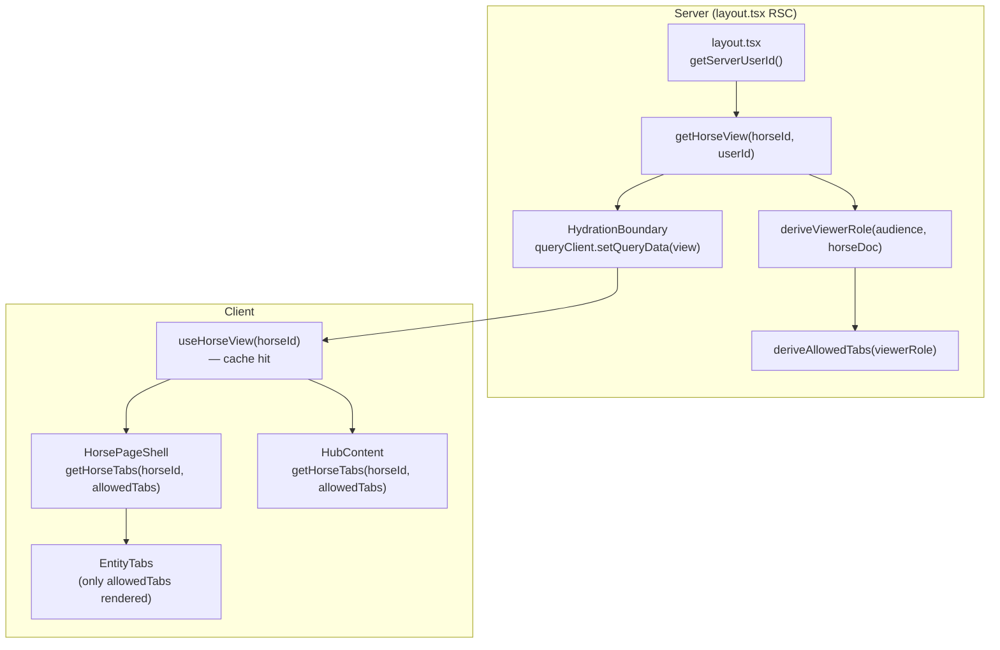

# Page Flow Blueprint

Canonical pattern for all entity sub-pages in Equus. Every page follows this structure — loading states, error boundaries, data fetching, and component hierarchy are standardized.

## 1. Directory Structure

```
app/[locale]/horses/[horseId]/
  layout.tsx            ← RSC (no "use client"): server-side data prefetch + HydrationBoundary
  page.tsx              ← Server Component: generateMetadata + one client render (Hub page)
  client.tsx            ← "use client": Hub content assembly (reads cache — no extra fetch)
  loading.tsx           ← SSR skeleton (mandatory)

app/[locale]/horses/[horseId]/<tab>/
  page.tsx              ← Server Component: generateMetadata + one client render
  client.tsx            ← "use client": content assembly (HorsePageShell + <Section> components)
  loading.tsx           ← SSR skeleton (mandatory)
```

**`layout.tsx`** pre-fetches once per navigation, seeds TanStack cache via `HydrationBoundary`. All child tabs read from this cache — no waterfall.

### Horse UI layout (`components/horses/`)

```
components/horses/
  shared/                 ← horse-only helpers used by 2+ tabs (not app-wide)
  admin/ | profile/ | connect/ | media/ | documents/ | planning/ | hub/ | create/ | list/ | history/
  horse-page-shell.tsx    ← chrome used by all ownership-gated horseId tabs
  horse-page-skeleton.tsx
components/shared/        ← ONLY multi-module primitives (Section, FileUpload, …)
```

**Tab rule:** a component rendered only on one tab lives under `components/horses/<tab>/`.

**Filename rule:** every horse-specific component file starts with `horse-` (e.g. `horse-visibility-section.tsx`). Export name matches (`HorseVisibilitySection`).

**Shared rule:** put UI in `components/shared/` only when used by multiple product modules. Cross-tab but horse-only helpers go in `components/horses/shared/`.

**Visibility vs discovery:** the Admin UI section is named **Visibility** (`HorseVisibilitySection`). It still calls `PATCH /api/v1/horses/:id/discovery` and persists `Horse.profileVisibility` (same discovery contract as other entities). Do not rename the REST path or Mongo field in horse-only UI cleanups.

#### Naming checklist (new horse sections)

- [ ] File under the correct `components/horses/<tab>/` (or `shared/` if 2+ tabs)
- [ ] Filename starts with `horse-`
- [ ] Exported component name is PascalCase matching the file (`HorseFooSection`)
- [ ] Not placed in `components/shared/` unless another module will import it
- [ ] Docs (`horses.md`, this blueprint) updated if the tab layout changes

## 2. Layout RSC (`layout.tsx`) — Server Prefetch

Sits at `app/[locale]/horses/[horseId]/layout.tsx`. Runs on the server for every navigation to any horse sub-page.

```tsx
// No "use client"
import { HydrationBoundary, QueryClient, dehydrate } from "@tanstack/react-query";
import { getServerUserId } from "@/lib/auth/serverSession.ts";
import { queryKeys } from "@/lib/api/queryKeys.ts";
import { getHorseView } from "@/lib/services/horseService.ts";
import connectDb from "@/lib/db.ts";

export default async function HorseLayout({ children, params }) {
  const { horseId } = await params;
  const queryClient = new QueryClient();
  try {
    await connectDb();
    const userId = await getServerUserId();
    const data = await getHorseView(horseId, userId);
    queryClient.setQueryData(queryKeys.horses.view(horseId), data);
  } catch {
    // Non-fatal: client will fetch on hydration
  }
  return (
    <HydrationBoundary state={dehydrate(queryClient)}>
      {children}
    </HydrationBoundary>
  );
}
```

Rules:
- No `"use client"`
- Calls `getHorseView` directly (service layer, not REST) — no HTTP waterfall
- Failure is non-fatal; client falls back to network fetch on hydration
- Provides `viewerRole`, `allowedTabs`, and merged `HorseViewDto` to all child tabs

## 3. Server Component (`page.tsx`) — Thin

```tsx
import type { Metadata } from "next";
import { generatePrivateMetadata } from "@/lib/seo/metadata-factory.ts";
import { ConnectContent } from "./client";

type PageProps = { params: Promise<{ horseId: string; locale: string }> };

export async function generateMetadata({ params }: PageProps): Promise<Metadata> {
  const { locale } = await params;
  return generatePrivateMetadata(locale, "/horses/[horseId]/connect", "metadata.horseConnect");
}

export default async function HorseConnectPage({ params }: PageProps) {
  const { horseId } = await params;
  return <ConnectContent horseId={horseId} />;
}
```

Rules:
- Only `generateMetadata` — no data fetching for content (layout handles that)
- Single client component render — no server-side section logic
- No `"use client"`

## 4. `loading.tsx` — SSR Skeleton

```tsx
import { HorsePageSkeleton } from "@/components/horses/horse-page-skeleton.tsx";

export default function TabLoading() {
  return <HorsePageSkeleton />;
}
```

Rules:
- **Mandatory per route segment.** Without it, SSR sends empty content in `{children}`, causing a visible blank flash before JS hydration.
- Uses a shared `*PageSkeleton` component, not bare `<Skeleton>`.
- For non-horse entity pages, create an `EntityPageSkeleton` following the same pattern.

## 5. Content Assembly (`client.tsx`)

The single Client Component that composes the shell + sections using the `<Section>` component. Co-located next to the route as `client.tsx`.

```tsx
"use client";

import { useTranslations } from "next-intl";

import { HorsePageShell } from "@/components/horses/horse-page-shell.tsx";
import { Section } from "@/components/shared/section.tsx";
import { HorseConnectInviteSection } from "@/components/horses/connect/horse-invite-section.tsx";
import { HorseConnectionsTableSection } from "@/components/horses/connect/horse-connections-table-section.tsx";

type Props = { horseId: string };

export function ConnectContent({ horseId }: Props) {
  const t = useTranslations("horseConnect");

  return (
    <HorsePageShell horseId={horseId}>
      <Section
        title={t("inviteSection")}
        description={t("description")}
      >
        <HorseConnectInviteSection horseId={horseId} />
      </Section>

      <Section
        title={t("connectionsSection")}
      >
        <HorseConnectionsTableSection horseId={horseId} />
      </Section>
    </HorsePageShell>
  );
}
```

Rules:
- No raw `fetch()` — all API calls go through TanStack Query hooks
- Every section uses `<Section>` — never manual `<section>` wrappers
- No error boundary around the shell itself (shell is the chrome — it should not crash from section errors)
- **Two section kinds** (see §6 and §6.5):
  - **Action sections** — own their mutations (invite, delete, transfer). `client.tsx` only composes them.
  - **Deferred form tabs** (Profile, Admin sale settings) — parent owns one `useForm`, one Save button, and dirty → unsaved-changes wiring. Field-group sections receive `control` only.

**Hub exception:** Hub (`/horses/[horseId]`) does NOT use `HorsePageShell` — it is public-facing. Its `client.tsx` reads from `useHorseView()` directly and renders its own `EntityTabs`. Data is already in the cache from `layout.tsx`.

## 5.5 The `Section` Component (`components/shared/section.tsx`)

Reusable layout wrapper that standardizes section headers across all pages. Pure layout — no data fetching, no visibility PATCH, no error handling.

```tsx
"use client";

import type { ReactNode } from "react";

import { cn } from "@/lib/utils";

type SectionProps = {
  title: string;
  description?: string;
  /** Slot for SectionVisibilityControl / entity adapters (e.g. HorseSectionVisibility). */
  visibilityControl?: ReactNode;
  className?: string;
  children: ReactNode;
};
```

### Layout
```
<section className={cn("flex min-h-0 flex-col gap-4", className)}>
  ├── <header> shrink-0
  │   ├── title + description
  │   └── visibilityControl? (entity adapter → SectionVisibilityControl → popover)
  └── children (rendered as-is — ErrorBoundary lives in client.tsx)
```

### Section visibility architecture (reuse across entities)

```
Section (layout slot)
  └── HorseSectionVisibility (entity adapter)     // or StableSectionVisibility later
        └── SectionVisibilityControl (shared behavior: toast, pending, persistMode)
              └── SectionVisibilityPopover (dumb UI)
```

- **Shared types:** `lib/visibility/sectionVisibility.ts` (`VisibilityMode`, `SectionVisibility`)
- **Shared control:** `components/shared/section-visibility-control.tsx` — identical behavior for every consumer
- **Shared popover:** `components/shared/section-visibility-popover.tsx` — UI only
- **Horse adapter:** `components/horses/shared/horse-section-visibility.tsx` → `PATCH …/horses/:id/hub-sections`
- **New entity:** add `*SectionVisibility` adapter + entity PATCH; reuse control unchanged. Do **not** wire `persistMode` / PATCH in page `client.tsx`.

### Rules
- **Always** use `<Section>` for page sections — never raw `<section>` elements
- Section is **pure layout** — it does NOT wrap children in ErrorBoundary. Wrap children in `ErrorBoundary` at the `client.tsx` level (see section 7)
- **Toggle is optional** — omit `visibilityControl` to render a section without visibility control
- **Section visibility is section-owned via adapter** — modes are `owner` | `relationship` | `public`. Autosave through the shared control; never parent form dirty/Save for Layer-2; never `PATCH …/discovery` for section modes
- **Hub-facing keys only on Hub** — Hub renders `identity` | `identification` | `pedigree` | `about` | `ownership` | `gallery` | `planning` | `connections`. Admin-only keys (`value` | `proactiveRepresentatives` | `coOwnerManagement`) persist via `HorseSectionVisibility` but are not Hub-facing.
- **Hub consumer** — Hub page reads `useHorseView(horseId)` which hits the TanStack cache (pre-seeded by `layout.tsx`). No extra network request. Renders only sections present in `horse.sections` (server-filtered by L1+L2 visibility). Do not load full owner horse and hide sections in React.
- **Parent controls sizing** via `className` — use `className="flex-1"` for sections that should fill remaining space, `className="shrink-0"` for sections that take natural height

## 5.6 Shell Component (`HorsePageShell`)

### Responsibilities
1. Read horse data from TanStack cache via `useHorseView(horseId)` (pre-seeded by `layout.tsx`)
2. Gate content behind auth + ownership using `viewerRole` / `allowedTabs` from the view response
3. Show skeleton while auth/data loads
4. Redirect on auth failure
5. Block content on permission failure (show "not allowed" fallback)
6. Wrap content in `UnsavedChangesProvider` for deferred form tabs

### 5.6.1 No data fetching in HorsePageShell
`HorsePageShell` no longer fetches data. It reads from the cache:

```tsx
const { data: view, isLoading } = useHorseView(horseId);
const horse = view?.horse;
const allowedTabs = view?.allowedTabs;
const isAdmin = horse?.isAdmin === true;
```

### 5.6.2 Auth redirect — no flash
```tsx
useEffect(() => {
  if (!isLoading && !isAuthenticated) {
    router.replace(buildSignInPath("/horses/" + horseId));
  }
}, [isLoading, isAuthenticated]);

if (!isAuthenticated && !isLoading) return null;
```

### 5.6.3 Loading state
```tsx
{isLoading || !horse ? <HorsePageSkeleton /> : children}
```

### 5.6.4 Permission-denied fallback
```tsx
const blocked = !isLoading && horse &&
  ((requireMainOwner && !isMainOwner) || (requireOwnership && !isAdmin));
```

## 5.7 viewerRole and allowedTabs

### Flow


### viewerRole enum
| Role | Condition |
|------|-----------|
| `main_owner` | `horse.mainOwnerUserId === userId` |
| `co_owner` | userId in `horse.coOwners[]` |
| `responsible` | userId in `horse.responsibles[]` |
| `related` | accepted `Relationship` or active host collaboration |
| `public` | authenticated, no relationship |
| `guest` | unauthenticated |

### Tab access (server-enforced)
| Tab | Minimum viewerRole |
|-----|--------------------|
| hub | `guest` |
| planning | `guest` |
| media | `guest` |
| documents | `guest` |
| connect | `responsible` |
| profile | `responsible` |
| history | `responsible` |
| admin | `main_owner` |

`getHorseTabs(horseId, allowedTabs)` in `lib/navigation/horseTabs.ts` filters to only the server-returned tabs. No client-side role inference.

## 6. Section Components — Action / Query Sections

Each **action or list** section is a `"use client"` component that:
- Owns its own TanStack Query hooks (`useQuery`, `useMutation`) when it performs immediate actions (invite, delete, upload, transfer)
- Shows inline skeleton during `isPending`
- Destructures data with fallback: `{ data = [] }`
- Uses `placeholderData: (prev) => prev` on all queries
- Does NOT define its own `ErrorBoundary` — the `client.tsx` assembly wraps each section child manually in `<ErrorBoundary fallbackRender={InlineErrorFallback}>`
- Does NOT use raw `fetch()` — always through hooks
- Does NOT render a page-level Save for deferred edits — that belongs to the parent form (see §6.5)

### Pattern
```tsx
"use client";
import { useTranslations } from "next-intl";
import { Skeleton } from "@/components/ui/skeleton.tsx";
import { useHorseProviders } from "@/hooks/queries/useHorse.ts";

export function HorseConnectionsTableSection({ horseId }: { horseId: string }) {
  const t = useTranslations("horseConnect");
  const { data: providers = [], isPending } = useHorseProviders(horseId, "accepted", {
    placeholderData: (prev) => prev,
  });

  if (isPending) {
    return <Skeleton className="h-[400px] w-full rounded-lg" />;
  }

  return <DataTable /* ... */ />;
}
```

## 6.5. Deferred Form Tabs — Parent-Owned Save (Profile, Admin)

Tabs that edit entity fields with a single Save (not immediate CRUD) follow this pattern:

1. **`client.tsx`** receives `horse` from `HorsePageShell` render props (type: `HorseViewDto` from `@/lib/services/horseService`)
2. Parent creates **one** `useForm` (+ Zod resolver), resets from horse data
3. Field-group sections receive `control` only — no `useForm`, no Save button, no mutations
4. Parent renders **one Save** that validates, builds dirty-field patches, calls TanStack mutations, then `form.reset(values)`
5. Parent syncs `formState.isDirty` / saving into `useUnsavedChanges()` so tab navigation + `beforeunload` warn about unsaved edits

### Parent sketch
```tsx
function ProfileForm({ horseId, horse }: { horseId: string; horse: HorseViewDto }) {
  const form = useForm<ProfileFormValues>({ resolver: zodResolver(schema), defaultValues: empty() });
  useEffect(() => { form.reset(toFormValues(horse)); }, [horse, form]);

  const { isDirty } = useFormState({ control: form.control });
  const { setDirty, setSaving } = useUnsavedChanges();
  useEffect(() => { setDirty(isDirty); }, [isDirty, setDirty]);

  async function onSave(values: ProfileFormValues) {
    const patch = buildPatch(values, form.formState.dirtyFields);
    await updateHorse.mutateAsync({ horseId, patch });
    form.reset(values);
  }

  return (
    <>
      <Section title="…"><HorseIdentitySection control={form.control} /></Section>
      {/* more field groups under components/horses/profile/ */}
      <Button onClick={form.handleSubmit(onSave)}>Save</Button>
      {/* Admin: HorseVisibilitySection uses visibilityFormSchema; still PATCH …/discovery */}
    </>
  );
}
```

### Rules
- **One Save per deferred form surface** — never per-section Save for the same form
- **Action sections on the same tab** (Admin history, ownership transfer, invites) keep immediate mutations; they do not join the deferred form
- **Unsaved guard** — `HorsePageShell` wraps content in `UnsavedChangesProvider`; `EntityTabs` intercepts navigation when dirty
- Reference implementations: `app/.../profile/client.tsx`, `app/.../admin/client.tsx`

## 7. Error Boundary Strategy — Stacked Layers

```
global-error.tsx              ← Root layout crash (unrecoverable)
  └─ [locale]/error.tsx       ← App chrome crash (keeps layout, shows recovery page)
      └─ AppErrorBoundary     ← Higher app crash (resets on route change)
          └─ HorsePageShell   ← Chrome (EntityTabs, sidebar) — no inline boundary
              │                 (falls back to AppErrorBoundary if chrome itself crashes)
              ├─ <Section>    ← pure layout (header only)
              │   ├─ header (title + toggle) — survives crashes
              │   └─ ErrorBoundary → HorseConnectInviteSection  ← from client.tsx
              │                   (fails → inline card, header + tabs survive)
              └─ <Section>    ← pure layout (header only)
                  ├─ header (title + toggle) — survives crashes
                  └─ ErrorBoundary → HorseConnectionsTableSection  ← from client.tsx
                                  (fails → inline card, header + tabs survive)
```

Rules:
- `ErrorBoundary` lives in `client.tsx`, wrapping each section's children inside the `<Section>` component
- `ErrorBoundary` only wraps **data-dependent children**, not the section header — if children throw, the section title + visibility toggle stay visible
- Each section is isolated — one failing does not cascade
- `AppErrorBoundary` is the last resort, not the first line of defense
- `InlineErrorFallback` is compact (card + Try Again button) — never full-page

## 8. Data Fetching Rules

1. **Layout-level prefetch** — `layout.tsx` RSC calls the service directly and seeds TanStack cache via `HydrationBoundary`. All tabs read from the pre-seeded cache — no waterfall.
2. **All client-side API calls** use TanStack Query (`useQuery` / `useMutation`)
3. **No raw `fetch()`** in any component — use hooks from `hooks/queries/`
4. **`placeholderData: (prev) => prev`** on every query — eliminates skeleton flash on tab switches
5. **`staleTime: 30_000`** (global default) — prevents repeated fetches on mount
6. **`enabled:`** for conditional queries (e.g. search needs min 2 chars)
7. **Query key factory** — use `queryKeys` (not ad-hoc arrays) for targeted invalidation
8. **Mutations invalidate `view` key** — `useUpdateHorse`, `useUpdateHorseSale`, `useUpdateHorseVisibility`, `useUpdateHorseHubSection` all invalidate `queryKeys.horses.view(horseId)` on success

## 9. Mutation Rules

1. Use `useMutation` — never `fetch().then()` in event handlers
2. `onSuccess` invalidates related queries (always include `queryKeys.horses.view`)
3. `onError` shows toast via `useAppToast()` — never silent `catch`
4. Mutation loading state: disable the submit button, show spinner text
5. **Deferred forms** — parent Save orchestrates one or more mutations from dirty fields; sections must not call those mutations themselves
6. **Immediate actions** — invites, deletes, transfers, uploads stay in their section components

## 10. i18n Rules

1. Content assembly calls `useTranslations` once and passes translated strings to sections (via props or the section calls it directly)
2. Sections call their own `useTranslations` when they have distinct namespaces
3. No hardcoded user-facing text

## 11. Checklist for New Horse Sub-Pages

```
[ ] Create `app/[locale]/horses/[horseId]/<tab>/page.tsx` — thin Server Component
[ ] Create `app/[locale]/horses/[horseId]/<tab>/loading.tsx` — uses HorsePageSkeleton
[ ] Create `app/[locale]/horses/[horseId]/<tab>/client.tsx` — HorsePageShell + <Section> components (co-located with the route)
[ ] Confirm layout.tsx exists at app/[locale]/horses/[horseId]/layout.tsx — it pre-fetches horse data for all sub-pages
[ ] For each data section in the tab:
    [ ] Extract into a dedicated "use client" section component
    [ ] Wrap it in <Section title={...} className="flex-1"> (never raw <section>)
    [ ] Wrap children inside <Section> with <ErrorBoundary fallbackRender={InlineErrorFallback}>
    [ ] Add visibilityControl={<HorseSectionVisibility … />} when the section needs Layer-2 visibility
    [ ] Use TanStack Query hooks (no raw fetch)
    [ ] Use `placeholderData: (prev) => prev`
    [ ] Show inline skeleton during `isPending`
    [ ] Handle errors with toast for mutations, ErrorBoundary for render errors
[ ] If the tab is a deferred form (Profile / Admin sale settings):
    [ ] Parent owns `useForm` + single Save + dirty → `useUnsavedChanges`
    [ ] Field sections receive `control` only (no per-section Save)
    [ ] Action sections on the same tab keep their own immediate mutations
[ ] Mutations in this tab's hooks invalidate `queryKeys.horses.view(horseId)`
[ ] Verify: tabs survive if one section crashes (header + other sections remain)
[ ] Verify: navigation between tabs shows no skeleton (placeholderData)
[ ] Verify: full page load (SSR) shows skeleton immediately, not after hydration
[ ] Verify (deferred forms): leaving with dirty fields shows unsaved-changes dialog
[ ] Update horses.md and horseTabs.md if the tab layout changes
```

## 12. Page Type Variants

| Type | Shell Component | Skeleton Component |
|---|---|---|
| Horse sub-page | `HorsePageShell` | `HorsePageSkeleton` |
| Stable sub-page | `StablePageShell` | `StablePageSkeleton` |
| Breeder sub-page | `BreederPageShell` | `BreederPageSkeleton` |
| (other entities) | `*PageShell` | `*PageSkeleton` |

Each entity type creates its own shell + skeleton following the exact same pattern. New entity shells should also follow the `layout.tsx` RSC prefetch pattern (§2) with a corresponding `getEntityView` service function.
