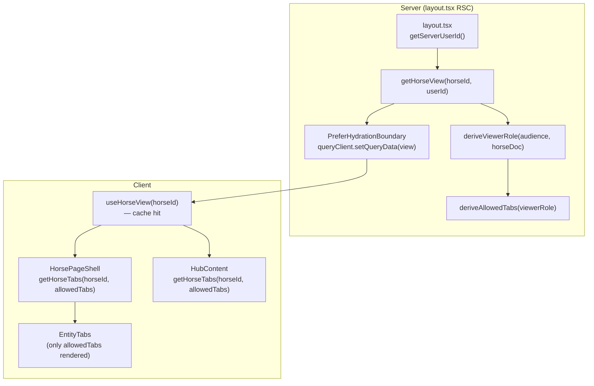

# Page Flow Blueprint

Canonical pattern for all entity sub-pages in Equus. Every page follows this structure — loading states, error boundaries, data fetching, and component hierarchy are standardized.

## 1. Directory Structure

```
app/[locale]/horses/[horseId]/
  layout.tsx            ← RSC (no "use client"): server-side data prefetch + PreferHydrationBoundary
  page.tsx              ← Server Component: generateMetadata + one client render (Hub page)
  client.tsx            ← "use client": Hub content assembly (reads cache — no extra fetch)
  loading.tsx           ← SSR skeleton (mandatory)

app/[locale]/horses/[horseId]/<tab>/
  page.tsx              ← Server Component: generateMetadata + one client render
  client.tsx            ← "use client": content assembly (HorsePageShell + <Section> components)
  loading.tsx           ← SSR skeleton (mandatory)
```

**`layout.tsx`** pre-fetches once per navigation, seeds TanStack cache via `PreferHydrationBoundary` (skips guest overwrite of an owner-scoped horse view). `getServerUserId` falls back to a valid refresh cookie when the access token is expired so RSC does not seed a guest view mid-session. All child tabs read from this cache — no waterfall.

### Horse UI layout (`components/horses/`)

```
components/horses/
  shared/                 ← horse-only helpers used by 2+ tabs (not app-wide)
  admin/ | profile/ | connect/ | media/ | documents/ | planning/ | hub/ | create/ | list/ | history/
  horse-page-shell.tsx    ← auth gate + ownership gate for all ownership-gated tabs
  horse-layout-chrome.tsx ← EntityTabs + content wrapper (rendered in layout.tsx)
  horse-page-content-skeleton.tsx  ← canonical body skeleton (used by loading.tsx + HorsePageShell)
  horse-page-skeleton.tsx          ← legacy hub page tab-level skeleton
components/shared/        ← ONLY multi-module primitives (Section, FileUpload, …)
```

**Tab rule:** a component rendered only on one tab lives under `components/horses/<tab>/`.

**Filename rule:** every horse-specific component file starts with `horse-` (e.g. `horse-visibility-section.tsx`). Export name matches (`HorseVisibilitySection`).

**Shared rule:** put UI in `components/shared/` only when used by multiple product modules. Cross-tab but horse-only helpers go in `components/horses/shared/`.

**Visibility vs discovery:** the Admin UI section is named **Visibility** (`HorseVisibilitySection`). It still calls `PATCH /api/v1/horses/:id/discovery` and persists `Horse.profileVisibility` (same discovery contract as other entities). Do not rename the REST path or Mongo field in horse-only UI cleanups.

#### Naming checklist (new horse sections)

- [ ] File under the correct `components/horses/<tab>/` (or `shared/` if 2+ tabs)
- [ ] Filename starts with `horse-`
- [ ] Exported component name is PascalCase matching the file (`HorseFooSection`)
- [ ] Not placed in `components/shared/` unless another module will import it
- [ ] Docs (`horses.md`, this blueprint) updated if the tab layout changes

## 2. Layout RSC (`layout.tsx`) — Server Prefetch

Sits at `app/[locale]/horses/[horseId]/layout.tsx`. Runs on the server for every navigation to any horse sub-page.

```tsx
// No "use client"
import { QueryClient, dehydrate } from "@tanstack/react-query";
import { PreferHydrationBoundary } from "@/components/shared/prefer-hydration-boundary.tsx";
import { getServerUserId, hasRefreshCookie } from "@/lib/auth/serverSession.ts";
import { queryKeys } from "@/lib/api/queryKeys.ts";
import { getHorseView } from "@/lib/services/horseService.ts";
import connectDb from "@/lib/db.ts";

export default async function HorseLayout({ children, params }) {
  const { horseId } = await params;
  const queryClient = new QueryClient();
  try {
    await connectDb();
    const userId = await getServerUserId(); // access token, else refresh cookie
    const canRecoverSession = !userId && (await hasRefreshCookie());
    if (!canRecoverSession) {
      const data = await getHorseView(horseId, userId);
      queryClient.setQueryData(queryKeys.horses.view(horseId), data);
    }
  } catch {
    // Non-fatal: client will fetch on hydration
  }
  return (
    <PreferHydrationBoundary state={dehydrate(queryClient)}>
      {children}
    </PreferHydrationBoundary>
  );
}
```

Rules:
- No `"use client"`
- Calls `getHorseView` directly (service layer, not REST) — no HTTP waterfall
- `getServerUserId` falls back to refresh cookie when access is expired (RSC cannot set cookies; client refresh still rotates access)
- Skip guest seed when refresh exists but identity unresolved — never overwrite owner cache with guest
- `PreferHydrationBoundary` also blocks guest→owner downgrade hydrations client-side
- Failure is non-fatal; client falls back to network fetch on hydration
- Provides `viewerRole`, `allowedTabs`, and merged `HorseViewDto` to all child tabs

## 3. Server Component (`page.tsx`) — Thin

```tsx
import type { Metadata } from "next";
import { generatePrivateMetadata } from "@/lib/seo/metadata-factory.ts";
import { ConnectContent } from "./client";

type PageProps = { params: Promise<{ horseId: string; locale: string }> };

export async function generateMetadata({ params }: PageProps): Promise<Metadata> {
  const { locale } = await params;
  return generatePrivateMetadata(locale, "/horses/[horseId]/connect", "metadata.horseConnect");
}

export default async function HorseConnectPage({ params }: PageProps) {
  const { horseId } = await params;
  return <ConnectContent horseId={horseId} />;
}
```

Rules:
- Only `generateMetadata` — no data fetching for content (layout handles that)
- Single client component render — no server-side section logic
- No `"use client"`

## 4. `loading.tsx` — SSR Skeleton

```tsx
import { HorsePageContentSkeleton } from "@/components/horses/horse-page-content-skeleton.tsx";

export default function TabLoading() {
  return <HorsePageContentSkeleton />;
}
```

Rules:
- **Mandatory per route segment.** The skeleton replaces the `{children}` slot during SSR streaming, preventing a blank content area.
- Uses `HorsePageContentSkeleton` — the **same skeleton** used by `HorsePageShell` for its body loading state. Same component = no visual swap when SSR transitions to client hydration.
- For non-horse entity pages, create an `EntityPageContentSkeleton` following the same pattern.
- Uses the Skeleton component's default `variant="skeleton"` (`bg-skeleton`) — visible on both `bg-card` and `bg-muted` backgrounds.

## 5. Content Assembly (`client.tsx`)

The single Client Component that composes the shell + sections using the `<Section>` component. Co-located next to the route as `client.tsx`.

```tsx
"use client";

import { useState } from "react";
import { useTranslations } from "next-intl";
import { ErrorBoundary } from "react-error-boundary";

import { HorsePageShell } from "@/components/horses/horse-page-shell.tsx";
import { Section } from "@/components/shared/section.tsx";
import { SectionTitleAction } from "@/components/shared/section-title-action.tsx";
import { HorseConnectionsTableSection } from "@/components/horses/connect/horse-connections-table-section.tsx";
import { HorseSectionVisibility } from "@/components/horses/shared/horse-section-visibility.tsx";
import { InlineErrorFallback } from "@/components/errors/inline-error-fallback.tsx";

type Props = { horseId: string };

export function ConnectContent({ horseId }: Props) {
  const t = useTranslations("horseConnect");
  const [inviteOpen, setInviteOpen] = useState(false);

  return (
    <HorsePageShell horseId={horseId} requireOwnership>
      {({ horse }) => (
        <Section
          title={t("connectionsSection")}
          className="flex-1"
          titleAddon={
            <SectionTitleAction onClick={() => setInviteOpen(true)}>
              {t("invite")}
            </SectionTitleAction>
          }
          visibilityControl={
            <HorseSectionVisibility
              horseId={horseId}
              sectionKey="connections"
              mode={horse.hubSections?.connections?.mode}
              uiSectionKey="connect-connections"
            />
          }
        >
          <ErrorBoundary fallbackRender={(p) => <InlineErrorFallback {...p} />}>
            <HorseConnectionsTableSection horseId={horseId} />
          </ErrorBoundary>
        </Section>
      )}
    </HorsePageShell>
  );
}
```

Rules:
- No raw `fetch()` — all API calls go through TanStack Query hooks
- Every data section is wrapped in `<ErrorBoundary>` inside the `<Section>` children slot — the section header (title, visibility) survives section crashes
- The shell gates ownership via `requireOwnership` / `requireMainOwner`, passing horse data via render props `{ horse, isOwner }`
- `Section` renders immediately (no data dependencies). Only the section's children wait on data.
- Invite/mutation dialogs mount beside the section, **not inside** the ErrorBoundary
- Section visibility uses the entity adapter (`HorseSectionVisibility`) wired through the Section's `visibilityControl` slot

## 5.5 The `Section` Component (`components/shared/section.tsx`)

Reusable layout wrapper that standardizes section headers across all pages. Pure layout — no data fetching, no visibility PATCH, no error handling.

```tsx
"use client";

import type { ReactNode } from "react";

import { cn } from "@/lib/utils";

type SectionProps = {
  title: string;
  description?: string;
  /** Content after the title, bordered like description (e.g. Connect Invite). */
  titleAddon?: ReactNode;
  /** Slot for SectionVisibilityControl / entity adapters (e.g. HorseSectionVisibility). */
  visibilityControl?: ReactNode;
  /** Slot for actions opposite the title (e.g. Documents Upload). */
  headerActions?: ReactNode;
  className?: string;
  children: ReactNode;
};
```

### Layout
```
<section className={cn("flex min-h-0 flex-col gap-4", className)}>
  ├── <header> shrink-0
  │   ├── title + titleAddon? + description?
  │   └── headerActions? + visibilityControl? (entity adapter → SectionVisibilityControl → allowed Popover)
  └── children (rendered as-is — ErrorBoundary lives in client.tsx)
```### Section visibility architecture (reuse across entities)

```
Section (layout slot)
  └── HorseSectionVisibility (entity adapter)     // or StableSectionVisibility later
        └── SectionVisibilityControl (shared behavior: toast, pending, persistMode)
              └── SectionVisibilityPopover (dumb UI — non-blocking Popover, not Dialog)
```

- **Shared types:** `lib/visibility/sectionVisibility.ts` (`VisibilityMode`, `SectionVisibility`)
- **Shared control:** `components/shared/section-visibility-control.tsx` — identical behavior for every consumer
- **Shared popover:** `components/shared/section-visibility-popover.tsx` — UI only; allowed Popover for quick mode picking (see §5.5.1 Overlays)
- **Horse adapter:** `components/horses/shared/horse-section-visibility.tsx` → `PATCH …/horses/:id/hub-sections`
- **New entity:** add `*SectionVisibility` adapter + entity PATCH; reuse control unchanged. Do **not** wire `persistMode` / PATCH in page `client.tsx`.

### 5.5.1 Overlays (Dialog / AlertDialog / Popover / Sheet)

Canonical overlay rules for all Equus UI. Do **not** invent a custom blur wrapper — use shadcn primitives.

| Primitive | When | Backdrop / page lock |
|-----------|------|----------------------|
| **`Dialog`** | Blocking task UI (media upload review, documents upload, connect invite, lightbox, planning create, deactivate account, command palette) | Yes (`DialogOverlay` blur) |
| **`AlertDialog`** via `ConfirmActionDialog` / `ConfirmDeleteDialog` | Confirmations (delete, unsaved leave, ownership confirm) | Yes (`AlertDialogOverlay` blur) |
| **`Popover`** | Non-blocking anchored controls (multi-select, invite picker, color badge legend, section visibility) | No — intentional |
| **`Sheet`** | Mobile nav drawer only (`sidebar.tsx`) | Side panel — keep |

**Rules:**
- Blocking flows **must** use `Dialog` or `AlertDialog` (blur + focus trap). Never use `Popover` for upload review, deletes, or multi-step confirmations.
- Anchored form/select UX stays on `Popover` (or `Select`); do not reinvent with Dialog.
- Prefer shared `ConfirmActionDialog` / `ConfirmDeleteDialog` for yes/no confirms.
- **Pending mutations in Dialogs:** use shared **`PendingDialog`** (`components/shared/pending-dialog.tsx`) — Dialog shell + centered shadcn **`Spinner`** overlay, block dismiss while `pending`. Do **not** re-copy overlay markup per feature. Domain dialogs (Connect invite, pedigree parent, documents upload, media upload review) compose on top of it.
- **`titleAddon` actions:** use **`SectionTitleAction`** (muted ghost, same tone as section visibility) — not primary `Button`.
- Media gallery: tile dropzone stays in-page; pending file review opens **`PendingDialog`**.
- Documents: single section with Upload via `SectionTitleAction` in `titleAddon`; upload form opens **`PendingDialog`**.
- Connect: single Connections section with Invite via `SectionTitleAction` in `titleAddon`; provider search opens **`PendingDialog`** (`HorseConnectInviteDialog`).
- Profile pedigree: Sire/Dam use **Add** (`SectionTitleAction`) → one reusable **`HorsePedigreeParentDialog`** (`PendingDialog` + `HorseInviteSection`); selected parent shows shared **`EntityChip`** (`entityType="horse"`, horse name + owner email → horse Hub) with clear.
- Admin proactive representatives / co-owner management: member **`EntityChip`**s (`entityType="user"`) + **Add** (`SectionTitleAction`) → **`HorseAdminRoleInviteDialog`** (`PendingDialog` + `UserInviteSection`); remove confirms via `ConfirmDeleteDialog`.
- Admin ownership management: current owner **`EntityChip`** + **Change owner** (`SectionTitleAction`) → **`HorseOwnershipChangeDialog`** (`PendingDialog` + search, then `ConfirmActionDialog` before `transfer_main`).
- **`EntityChip`** (`components/shared/entity-chip.tsx`) — canonical cross-entity identity card; hub URLs via `entityHubPath` (`lib/navigation/entityPaths.ts`). User + horse now; extend the union/path map for stable, groom, etc. later.
### Rules
- **Always** use `<Section>` for page sections — never raw `<section>` elements
- Section is **pure layout** — it does NOT wrap children in ErrorBoundary. Wrap children in `ErrorBoundary` at the `client.tsx` level (see section 7)
- **Toggle is optional** — omit `visibilityControl` to render a section without visibility control
- **Header actions are optional** — use `headerActions` for section-level buttons opposite the title when needed
- **Title addon is optional** — use `titleAddon` for content immediately after the title with a left border (same visual pattern as description; e.g. Connect Invite, Documents Upload)
- **Section visibility is section-owned via adapter** — modes are `owner` | `relationship` | `public`. Autosave through the shared control; never parent form dirty/Save for Layer-2; never `PATCH …/discovery` for section modes. Control UI is a **Popover** (allowed non-blocking overlay), not a Dialog.
- **Hub-facing keys only on Hub** — Hub renders `identity` | `identification` | `pedigree` | `about` | `ownership` | `value` | `proactiveRepresentatives` | `coOwnerManagement` | `gallery` | `planning` | `connections`. All keys persist via `HorseSectionVisibility` and project to the Hub when Layer 2 allows.
- **Hub consumer** — Hub page reads `useHorseView(horseId)` which hits the TanStack cache (pre-seeded by `layout.tsx`). No extra network request. Renders only sections present in `horse.sections` (server-filtered by L1+L2 visibility). Do not load full owner horse and hide sections in React.
- **Parent controls sizing** via `className` — use `className="flex-1"` for sections that should fill remaining space, `className="shrink-0"` for sections that take natural height

## 5.6 Shell Component (`HorsePageShell`)

### Responsibilities
1. Check auth state via `useAppAuth()` — redirect unauthenticated users to sign-in
2. Read horse data from TanStack cache via `useHorseView(horseId)` (pre-seeded by `layout.tsx` RSC)
3. Gate content behind ownership using `horse.isAdmin` / `horse.isMainOwner`
4. Show ONE body skeleton (`HorsePageContentSkeleton`) while auth or view data is loading
5. Show "not allowed" fallback for permission failures
6. Pass `{ horse, isOwner }` to children via render props

### Implementation (simplified — no useRef privilege hold)

```tsx
"use client";

import { useEffect } from "react";
import { useRouter } from "next/navigation";
import type { ReactNode } from "react";

import { HorsePageContentSkeleton } from "@/components/horses/horse-page-content-skeleton.tsx";
import { buildSignInPath } from "@/lib/navigation/postAuthRedirect.ts";
import { useHorseView } from "@/hooks/queries/useHorse.ts";
import { useAppAuth } from "@/hooks/use-app-auth.ts";

export function HorsePageShell({ horseId, requireOwnership, requireMainOwner, children }) {
  const router = useRouter();
  const { isAuthenticated, isLoading: isAuthLoading } = useAppAuth();
  const { data: view, isLoading: isViewLoading } = useHorseView(horseId);

  const isLoading = isAuthLoading || isViewLoading;
  const horse = view?.horse;
  const isAdmin = horse?.isAdmin === true;
  const isMainOwner = horse?.isMainOwner === true;

  useEffect(() => {
    if (isLoading) return;
    if (!isAuthenticated) {
      router.replace(buildSignInPath("/horses/" + horseId));
    }
  }, [isLoading, isAuthenticated, router, horseId]);

  const blocked =
    !isLoading &&
    Boolean(horse) &&
    ((requireMainOwner && !isMainOwner) || (requireOwnership && !isAdmin));

  if (isLoading || !horse) {
    return <HorsePageContentSkeleton suppressHydrationWarning />;
  }

  if (!isAuthenticated) {
    return <HorsePageContentSkeleton suppressHydrationWarning />;
  }

  if (blocked) {
    return <p className="text-muted-foreground">You don't have permission to view this page.</p>;
  }

  return typeof children === "function"
    ? children({ horse, isOwner: isMainOwner })
    : children;
}
```

### Key design decisions

- **No `useRef` privilege hold pattern.** `placeholderData: (prev) => prev` on `useHorseView` preserves the previous horse data during background refetch — `horse?.isAdmin` stays correct without manual ref management.
- **`isAdmin` / `isMainOwner` are direct checks** (`horse?.isAdmin === true`), not computed from cached refs or derived state.
- **`HorsePageContentSkeleton` is the single body skeleton** — same component used by `loading.tsx`. Same visual = no flash on SSR→client transition.
- **Auth redirect runs in `useEffect`** — never blocks render. While auth is loading, the skeleton shows.
- **Render props pattern** — children receive `{ horse, isOwner }` directly, no prop drilling.

### Hub exception
Hub (`/horses/[horseId]`) does NOT use `HorsePageShell` — it is public-facing. Its `client.tsx` reads from `useHorseView()` directly and renders its own `EntityTabs`. Data is already in the cache from `layout.tsx`.

## 5.7 viewerRole and allowedTabs

### Flow


### viewerRole enum
| Role | Condition |
|------|-----------|
| `main_owner` | `horse.mainOwnerUserId === userId` |
| `co_owner` | userId in `horse.coOwners[]` |
| `responsible` | userId in `horse.responsibles[]` |
| `related` | accepted `Relationship` or active host collaboration |
| `public` | authenticated, no relationship |
| `guest` | unauthenticated |

### Tab access (server-enforced)
| Tab | Minimum viewerRole |
|-----|--------------------|
| hub | `guest` |
| planning | `related` |
| media | `related` |
| documents | `related` |
| connect | `responsible` |
| profile | `responsible` |
| history | `responsible` |
| admin | `main_owner` |

`getHorseTabs(horseId, allowedTabs)` in `lib/navigation/horseTabs.ts` filters to only the server-returned tabs. Falls back to `[hub]` when `allowedTabs` is undefined. No client-side role inference.

## 6. Section Components — Action / Query Sections

Each **action or list** section is a `"use client"` component that:
- Owns its own TanStack Query hooks (`useQuery`, `useMutation`)
- Destructures `{ data = [], isPending, isError }` from queries
- Shows inline skeleton during `isPending`
- Shows error state when `isError` is true (not an empty table)
- Uses `placeholderData: (prev) => prev` on all queries (handled inside hook definitions)
- Does NOT define its own `ErrorBoundary` — the `client.tsx` assembly wraps each section child in `<ErrorBoundary fallbackRender={InlineErrorFallback}>`
- Does NOT use raw `fetch()` — always through hooks

### Pattern
```tsx
"use client";
import { useTranslations } from "next-intl";
import { Skeleton } from "@/components/ui/skeleton.tsx";
import { Spinner } from "@/components/ui/spinner.tsx";

export function ExampleTableSection({ horseId }: { horseId: string }) {
  const t = useTranslations("namespace");
  const { data: items = [], isPending, isError } = useSomeQuery(horseId);

  if (isPending) {
    return <ExampleTableSkeleton />;
  }

  if (isError) {
    return <p className="text-sm text-destructive">{t("loadFailed")}</p>;
  }

  return <DataTable data={items} /* ... */ />;
}

function ExampleTableSkeleton() {
  return (
    <div className="relative w-full h-[400px]">
      <Spinner className="absolute inset-0 z-10 m-auto size-6" />
      <Skeleton className="h-full w-full rounded-lg" />
    </div>
  );
}
```

### Horse entity tables

Single table system: `components/table` (`DataTable`). Visual SoT: History (`horse-history-audit-section.tsx`). Connect, Documents, and History reuse the same helpers — do not re-copy avatar/action markup.

Shared helpers (export from `components/table`):
- `initialsFromLabel` — avatar initials
- `TableUserAvatarCell` — centered `Avatar size="sm"`
- `TableRowAction` — labeled row action (theme default `Button`)
- `TableIconAction` — ghost `size="icon"` row action

Every horse `DataTable` must pass:

```tsx
enableSorting
enableFiltering
isRealtimeFilterColumn={() => true}
columnOrder={[...COLUMN_ORDER]}
defaultColumnOrder={[...COLUMN_ORDER]}
```

plus `dropdownOptionsByColumnKey` when any column uses `filterType: "dropdown"`.

### Skeleton pattern (table / data sections)

Data-dependent sections use a skeleton + Spinner overlay while loading:

```tsx
// components/horses/<tab>/horse-<name>-skeleton.tsx
import { Skeleton } from "@/components/ui/skeleton.tsx";
import { Spinner } from "@/components/ui/spinner.tsx";

export function HorseConnectionsTableSkeleton({ showSpinner = true }) {
  return (
    <div className="relative w-full h-full">
      {showSpinner && (
        <div className="absolute inset-0 z-10 flex items-center justify-center">
          <Spinner className="size-6" />
        </div>
      )}
      <Skeleton className="inset-0 h-full w-full p-4 rounded-md" />
    </div>
  );
}
```

- Uses `bg-skeleton` via the `Skeleton` component's default `variant="skeleton"` — visible on `bg-card` / `bg-muted` backgrounds
- `showSpinner` defaults to `true`; disable for sub-skeletons where a parent skeleton already shows a spinner
- The `Skeleton` uses Tailwind's `animate-pulse` — CSS handles the animation, no JavaScript needed

## 6.5. Deferred Form Tabs — Parent-Owned Save (Profile, Admin)

Tabs that edit entity fields with a single Save (not immediate CRUD) follow this pattern:

1. **`client.tsx`** receives `horse` from `HorsePageShell` render props (type: `HorseViewDto` from `@/lib/services/horseService`)
2. Parent creates **one** `useForm` (+ Zod resolver), resets from horse data
3. Field-group sections receive `control` only — no `useForm`, no Save button, no mutations
4. Parent renders **one Save** that validates, builds dirty-field patches, calls TanStack mutations, then `form.reset(values)`
5. Parent syncs `formState.isDirty` / saving into `useUnsavedChanges()` so tab navigation + `beforeunload` warn about unsaved edits

### Parent sketch
```tsx
function ProfileForm({ horseId, horse }: { horseId: string; horse: HorseViewDto }) {
  const form = useForm<ProfileFormValues>({ resolver: zodResolver(schema), defaultValues: empty() });
  useEffect(() => { form.reset(toFormValues(horse)); }, [horse, form]);

  const { isDirty } = useFormState({ control: form.control });
  const { setDirty, setSaving } = useUnsavedChanges();
  useEffect(() => { setDirty(isDirty); }, [isDirty, setDirty]);

  async function onSave(values: ProfileFormValues) {
    const patch = buildPatch(values, form.formState.dirtyFields);
    await updateHorse.mutateAsync({ horseId, patch });
    form.reset(values);
  }

  return (
    <>
      <Section title="…"><HorseIdentitySection control={form.control} /></Section>
      {/* more field groups under components/horses/profile/ */}
      <Button onClick={form.handleSubmit(onSave)}>Save</Button>
      {/* Admin: HorseVisibilitySection uses visibilityFormSchema; still PATCH …/discovery */}
    </>
  );
}
```

### Rules
- **One Save per deferred form surface** — never per-section Save for the same form
- **Action sections on the same tab** (Admin history, ownership transfer, invites) keep immediate mutations; they do not join the deferred form
- **Unsaved guard** — `HorsePageShell` wraps content in `UnsavedChangesProvider`; `EntityTabs` intercepts navigation when dirty
- Reference implementations: `app/.../profile/client.tsx`, `app/.../admin/client.tsx`

## 7. Error Boundary Strategy — Stacked Layers

```
global-error.tsx              ← Root layout crash (unrecoverable)
  └─ [locale]/error.tsx       ← App chrome crash (keeps layout, shows recovery page)
      └─ AppErrorBoundary     ← Higher app crash (resets on route change)
          └─ HorseLayoutChrome    ← EntityTabs + content wrapper
              ├─ EntityTabs       ← survive section crashes
              └─ content area
                  └─ HorsePageShell   ← gates auth/ownership, shows body skeleton
                      └─ <Section>    ← pure layout (title + addon + visibility header)
                          ├─ header → survives section crashes
                          └─ ErrorBoundary → <SectionComponent />   ← from client.tsx
                              (fails → InlineErrorFallback card, header + tabs survive)
                      (+ invite/mutation Dialogs mounted beside sections — not inside ErrorBoundary)
```

Rules:
- `ErrorBoundary` lives in `client.tsx`, wrapping each data-dependent section child inside `<Section>`
- `ErrorBoundary` only wraps **data-dependent children**, not the section header — if children throw, the section title + visibility toggle stay visible
- Each section is isolated — one failing does not cascade
- `AppErrorBoundary` is the last resort, not the first line of defense
- `InlineErrorFallback` is compact (card + Try Again button) — never full-page
- Mutation Dialogs (invite, delete, upload) are mounted **beside** sections, not inside ErrorBoundary wrappers

## 8. Data Fetching Rules

1. **Layout-level prefetch** — `layout.tsx` RSC calls `getHorseView` directly (service layer) and seeds TanStack cache via `PreferHydrationBoundary`. `getServerUserId` resolves via access token, then refresh cookie. All tabs read from the pre-seeded cache — no waterfall.
2. **All client-side API calls** use TanStack Query (`useQuery` / `useMutation`)
3. **No raw `fetch()`** in any component — use hooks from `hooks/queries/`
4. **`placeholderData: (prev) => prev`** on every query — eliminates skeleton flash on tab switches
5. **`staleTime: 30_000`** (global default) — prevents repeated fetches on mount
6. **`enabled:`** for conditional queries (e.g. search needs min 2 chars)
7. **Query key factory** — use `queryKeys` (not ad-hoc arrays) for targeted invalidation
8. **Mutations invalidate `view` key** — `useUpdateHorse`, `useUpdateHorseSale`, `useUpdateHorseVisibility`, `useUpdateHorseHubSection` all invalidate `queryKeys.horses.view(horseId)` on success

## 9. Mutation Rules

1. Use `useMutation` — never `fetch().then()` in event handlers
2. `onSuccess` invalidates related queries (always include `queryKeys.horses.view`)
3. `onError` shows toast via `useAppToast()` — never silent `catch`
4. Mutation loading state: disable the submit button, show spinner text
5. **Deferred forms** — parent Save orchestrates one or more mutations from dirty fields; sections must not call those mutations themselves
6. **Immediate actions** — invites, deletes, transfers, uploads stay in their section components

## 10. i18n Rules

1. Content assembly calls `useTranslations` once and passes translated strings to sections (via props or the section calls it directly)
2. Sections call their own `useTranslations` when they have distinct namespaces
3. No hardcoded user-facing text

## 11. Checklist for New Horse Sub-Pages

```
[ ] Create app/[locale]/horses/[horseId]/<tab>/page.tsx — thin Server Component
[ ] Create app/[locale]/horses/[horseId]/<tab>/loading.tsx — uses HorsePageContentSkeleton (same as body skeleton)
[ ] Create app/[locale]/horses/[horseId]/<tab>/client.tsx — HorsePageShell + <Section> components (co-located with route)
[ ] Confirm layout.tsx exists at app/[locale]/horses/[horseId]/layout.tsx — it pre-fetches horse data for all sub-pages
[ ] For each data section in the tab:
    [ ] Extract into a dedicated "use client" section component under components/horses/<tab>/
    [ ] Filename starts with horse- (e.g. horse-connections-table-section.tsx)
    [ ] Wrap it in <Section title={...} className="flex-1"> (never raw <section>)
    [ ] Wrap children inside <Section> with <ErrorBoundary fallbackRender={InlineErrorFallback}>
    [ ] Add visibilityControl={<HorseSectionVisibility … />} when section needs Layer-2 visibility
    [ ] Use TanStack Query hooks with destructured { data = [], isPending, isError }
    [ ] Section hooks use placeholderData: (prev) => prev (defined inside hook, not passed by caller)
    [ ] Show skeleton + Spinner overlay during isPending (create a <Name>Skeleton component)
    [ ] Show error message when isError (not an empty table)
    [ ] Invite/mutation Dialogs mount beside sections, not inside ErrorBoundary
[ ] If the tab is a deferred form (Profile / Admin sale settings):
    [ ] Parent owns useForm + single Save + dirty → useUnsavedChanges
    [ ] Field sections receive control only (no per-section Save)
    [ ] Action sections on the same tab keep their own immediate mutations
[ ] Mutations in this tab's hooks invalidate queryKeys.horses.view(horseId)
[ ] Verify: tabs survive if one section crashes (header + other sections remain)
[ ] Verify: navigation between tabs shows no skeleton (placeholderData)
[ ] Verify: cold page load (SSR) shows ONE body skeleton, not multiple flashes
[ ] Verify: loading.tsx and HorsePageShell use the SAME skeleton component (HorsePageContentSkeleton)
[ ] Verify (deferred forms): leaving with dirty fields shows unsaved-changes dialog
[ ] Update horses.md and horseTabs.md if the tab layout changes
```

## 12. Page Type Variants

| Type | Shell Component | Body Skeleton |
|------|----------------|---------------|
| Horse sub-page | `HorsePageShell` | `HorsePageContentSkeleton` |
| Stable sub-page | `StablePageShell` | `StablePageContentSkeleton` |
| Breeder sub-page | `BreederPageShell` | `BreederPageContentSkeleton` |
| (other entities) | `*PageShell` | `*PageContentSkeleton` |

Each entity type creates its own shell + skeleton following the exact same pattern. New entity shells should also follow the `layout.tsx` RSC prefetch pattern (§2) with a corresponding `getEntityView` service function.
