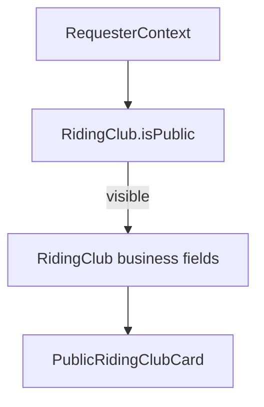

# Riding clubs API (`/api/v1/riding-clubs`)

Reference for minimal riding club endpoints and discovery visibility behavior.

Related:
- [`../../documentation/userModule.md`](../../documentation/userModule.md)
- [`horses.md`](./horses.md)
- [`stables.md`](./stables.md)
- [`profile.md`](./profile.md)

---

## Endpoints

| Method | Path | Purpose |
|--------|------|---------|
| `POST` | `/api/v1/riding-clubs` | Create a riding club owned by the authenticated user (`mainOwnerUserId`) |
| `PATCH` | `/api/v1/riding-clubs/:id/discovery` | Update discovery settings (`isPublic`, `acceptsNewMembers`) for owner/co-owner |
| `GET` | `/api/v1/riding-clubs/:id` | Return public riding club card filtered by `isPublic` and requester context |

A single User may create **multiple** riding clubs (unlike user-linked roles). Partnership uses the same `mainOwnerUserId` + `coOwners[]` embed as stables and transport companies.

---

## Discovery visibility model

- `RidingClub.isPublic` (default `true`) controls anonymous discovery.
- When `isPublic: false`, visible only to owner/co-owner, active collaborators at the club, or users with an accepted horse ↔ riding club `Relationship`.
- Business contact (`clubName`, `email`, `phoneNumber`) lives on the **entity** — not filtered through `User.preferences`.

---

## Public card fields

`GET /api/v1/riding-clubs/:id` returns a `PublicRidingClubCard`:

- `id`, `clubName`, `description`, `city`, `country` (from address)
- `disciplines`, `facilities`, `membershipInfo`, `membershipFee`, `acceptsNewMembers`, `isPublic`
- `contact: { email?, phone? }`

Returns **404** when discovery rules deny access (same pattern as horses and stables).

---

## Implementation

- Discovery rules: `lib/ridingClubs/ridingClubDiscoveryAccess.ts`
- Public card mapper: `lib/ridingClubs/buildPublicRidingClubCard.ts`
- Service: `lib/services/ridingClubService.ts`
- Validation: `lib/validations/ridingClub.ts`

Collaboration APIs: `/api/v1/role-profiles/ridingClub/:id/workplace-relationships`.
