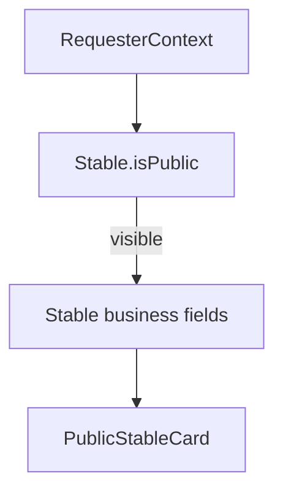

# Stables API (`/api/v1/stables`)

Reference for minimal stable endpoints and discovery visibility behavior.

Related:
- [`../../documentation/userAndRoles.md`](../../documentation/userAndRoles.md)
- [`../../documentation/stableModule.md`](../../documentation/stableModule.md)
- [`horses.md`](./horses.md)
- [`profile.md`](./profile.md)

---

## Endpoints

| Method | Path | Purpose |
|--------|------|---------|
| `POST` | `/api/v1/stables` | Create a stable owned by the authenticated user (`mainOwnerUserId`) |
| `PATCH` | `/api/v1/stables/:id/discovery` | Update discovery settings (`isPublic`, `acceptsNewHorses`) for owner/co-owner |
| `GET` | `/api/v1/stables/:id` | Return public stable card filtered by `isPublic` and requester context |

---

## Discovery visibility model

- `Stable.isPublic` (default `true`) controls whether the stable appears in anonymous discovery.
- When `isPublic: false`, the stable is visible only to owner/co-owner, active collaborators at the stable, or users with an accepted horse ↔ stable `Relationship`.
- Business contact (`tradeName`, `email`, `phoneNumber`) lives on the **entity** — not filtered through `User.preferences`. A private user may still operate a public stable listing.

---

## Public card fields

`GET /api/v1/stables/:id` returns a `PublicStableCard`:

- `id`, `tradeName`, `description`, `city`, `country` (from address)
- `disciplines`, `services`, `acceptsNewHorses`, `isPublic`
- `contact: { email?, phone? }`

Returns **404** when discovery rules deny access (same pattern as horses).

---

## Implementation

- Discovery rules: `lib/stables/stableDiscoveryAccess.ts`
- Public card mapper: `lib/stables/buildPublicStableCard.ts`
- Service: `lib/services/stableService.ts`
- Validation: `lib/validations/stable.ts`

Collaboration and workplace APIs remain under `/api/v1/role-profiles/stable/:id/workplace-relationships`.
