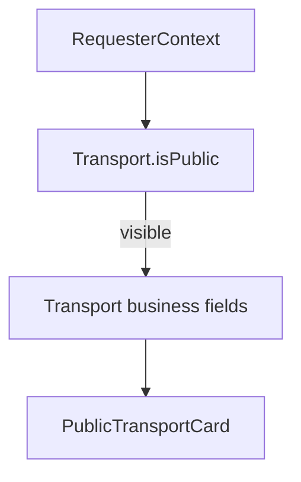

# Transports API (`/api/v1/transports`)

Reference for minimal transport company endpoints and discovery visibility behavior.

Related:
- [`../../documentation/userModule.md`](../../documentation/userModule.md)
- [`horses.md`](./horses.md)
- [`stables.md`](./stables.md)
- [`profile.md`](./profile.md)

---

## Endpoints

| Method | Path | Purpose |
|--------|------|---------|
| `POST` | `/api/v1/transports` | Create a transport company owned by the authenticated user (`mainOwnerUserId`) |
| `PATCH` | `/api/v1/transports/:id/discovery` | Update discovery settings (`isPublic`, `acceptsNewBookings`) for owner/co-owner |
| `GET` | `/api/v1/transports/:id` | Return public transport card filtered by `isPublic` and requester context |

A single User may create **multiple** transport companies (unlike user-linked roles). Partnership uses the same `mainOwnerUserId` + `coOwners[]` embed as stables and riding clubs.

---

## Discovery visibility model

- `Transport.isPublic` (default `true`) controls anonymous discovery.
- When `isPublic: false`, visible only to owner/co-owner, active collaborators at the transport company, or users with an accepted horse ↔ transport `Relationship`.
- Business contact (`companyName`, `email`, `phoneNumber`, `emergencyPhoneNumber`) lives on the **entity** — not filtered through `User.preferences`.

---

## Public card fields

`GET /api/v1/transports/:id` returns a `PublicTransportCard`:

- `id`, `companyName`, `description`, `city`, `country` (from address)
- `specialties`, `serviceAreas`, `acceptsNewBookings`, `isPublic`
- `contact: { email?, phone?, emergencyPhone? }`

Returns **404** when discovery rules deny access (same pattern as horses and stables).

---

## Implementation

- Discovery rules: `lib/transports/transportDiscoveryAccess.ts`
- Public card mapper: `lib/transports/buildPublicTransportCard.ts`
- Service: `lib/services/transportService.ts`
- Validation: `lib/validations/transport.ts`

Collaboration APIs: `/api/v1/role-profiles/transport/:id/workplace-relationships`.
